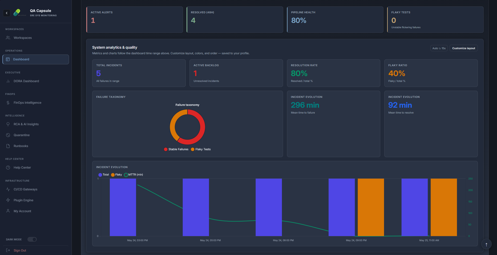
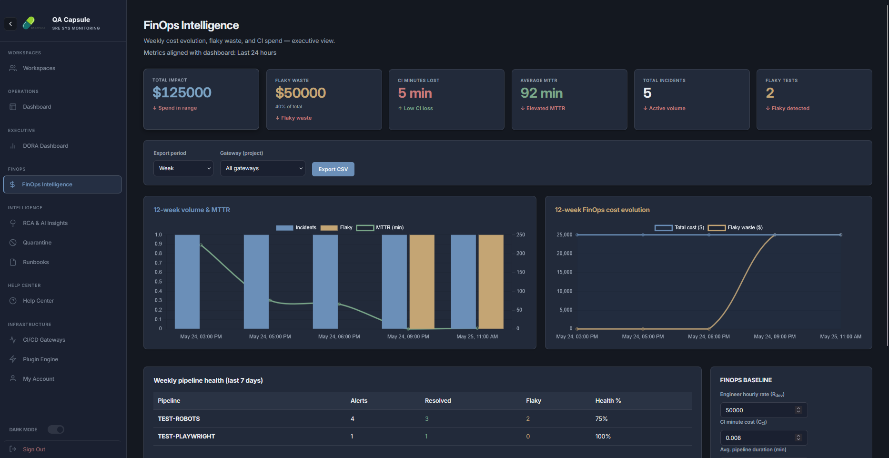
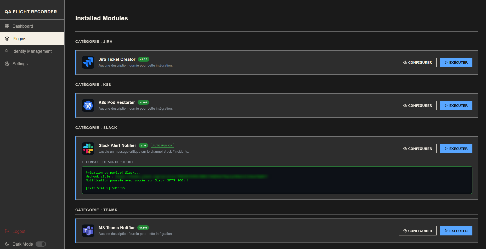

# QA Flight Recorder (QA Capsule)

[](https://ashraf-khabar.github.io/qa-capsule/)


[](https://ashraf-khabar.github.io/qa-capsule/)

**QA Flight Recorder** is an enterprise-grade, SRE-oriented control plane designed to monitor system telemetry, detect flaky tests, and automate incident response. It bridges the gap between CI/CD pipeline failures and infrastructure auto-remediation.

<p align="center">
  
</p>
<p align="center">
  
</p>
<p align="center">
  
</p>

---

## Why QA Capsule?

Modern CI/CD pipelines generate too much noise. When a database goes down, 100 tests fail, generating 100 identical Slack alerts. **QA Capsule solves "Alert Fatigue"** by correlating identical events, tracking unstable tests, and auto-triggering remediation scripts.

## Key Features

### Smart Event Correlation Engine
* **Deduplication:** Identifies and groups identical pipeline failures using SHA-256 fingerprinting.
* **Flakiness Detection:** Automatically tags `[FLAKY]` tests if they fail and pass intermittently within a 48h window.
* **Analytics & MTTR:** Visual dashboards (Chart.js) to track your Mean Time To Resolution and Technical Debt (Stable vs. Flaky failures).

### Auto-Remediation & Plugin Engine
* **Dynamic Routing:** Automatically route specific project alerts to dedicated Slack channels, MS Teams, or Jira projects.
* **Actionable Runbooks:** Execute custom Bash/Python scripts (e.g., K8s pod restarts, cache clears) directly from the UI or automatically upon specific trigger words (`CRITICAL`, `Timeout`).

### Multi-Tenancy & IAM (Identity Access Management)
* **Hierarchical Workspaces:** Create Teams and Sub-Groups for granular project assignments.
* **Granular RBAC:** Global roles (Admin, Operator, Viewer) mixed with Team-level roles for maximum security.
* **Zero-Trust Ready:** Enforced Domain-Lock policies (e.g., allow only `@company.com` users) and forced password resets.

### Universal CI/CD Gateways
* Provision dedicated API Webhook endpoints in 1 click for **GitHub Actions**, **GitLab CI**, and **Jenkins**.

---

## Technology Stack

* **Backend:** Go (Golang) 1.24+ (High concurrency, extremely low memory footprint)
* **Frontend:** Vanilla JavaScript (ES6+), HTML5/CSS3 (Zero heavy frameworks, Industrial SRE Design)
* **Database:** SQLite (Embedded, lightning-fast CGO-free driver via `modernc.org/sqlite`)
* **DevOps:** Docker, Docker Compose, Kubectl, JQ, cURL

---

## Quick Start (Docker)

The easiest way to run QA Capsule in production is via Docker.

### Prerequisites
* Docker & Docker Compose installed.

### Installation

1. **Clone the repository:**
   ```bash
   git clone [https://github.com/Ashraf-Khabar/qa-capsule.git](https://github.com/Ashraf-Khabar/qa-capsule.git)
   cd qa-capsule

2. Launch the Control Plane:

    ```bash
    docker-compose up -d --build
    ```
3. Access the Dashboard:

    Open http://localhost:9000 in your browser.

    * Default Initial Login: `admin` / `admin`
    * Note: The system will force you to update this temporary password upon your first login for security reasons.

## Plugin System Example

Plugins are JSON files linked to execution scripts located in the `/plugins` directory.

Example: Slack Auto-Notifier (`plugins/slack/slack-notifier.json`)

```json
{
  "name": "Smart Slack Routing",
  "version": "1.2",
  "description": "Dynamically alerts the responsible team on their assigned Slack channel.",
  "status": "Active",
  "command": "slack-action.sh",
  "trigger_on": ["CRITICAL", "Timeout"],
  "env": {
    "SLACK_WEBHOOK_URL": "https://hooks.slack.com/services/..."
  }
}
```

## Security

If you discover a security vulnerability, please do not open a public issue. Reach out directly to the maintainers.

## License

This project is licensed under the `MIT License` - see the `LICENSE` file for details.