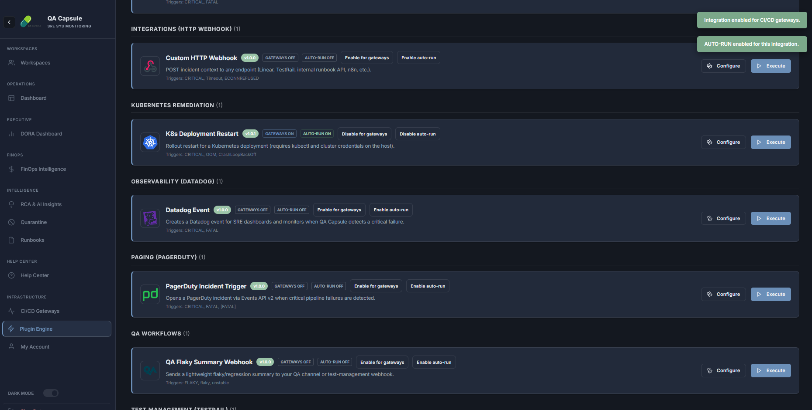
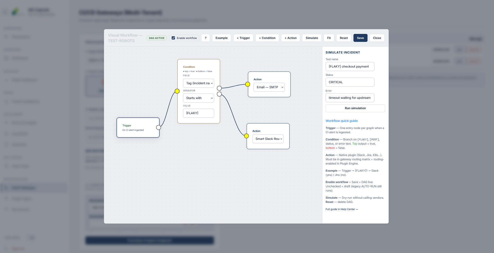
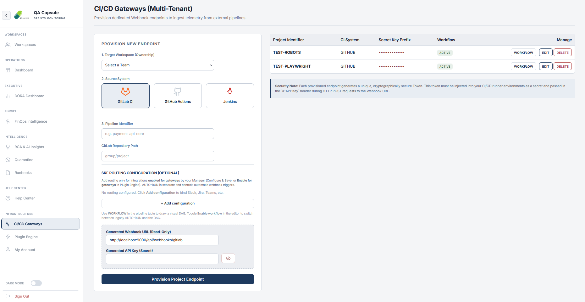

# QA Flight Recorder (QA Capsule) — Community

[](https://qa-capsule.github.io/qa-capsule-community/)


[](https://qa-capsule.github.io/qa-capsule-community/)

**QA Capsule** is an SRE control plane for CI/CD and E2E test failures: ingest, correlate, quarantine flaky tests, run native integrations (no shell plugins), AI RCA, FinOps, DORA, and a full web dashboard.

<p align="center">
  
</p>

<p align="center">
  
</p>

<p align="center">
  
</p>

<p align="center">
  
</p>

<p align="center">
  
</p>

---

## Why QA Capsule?

When a shared dependency fails, hundreds of tests can fail at once. QA Capsule **deduplicates** by fingerprint and pipeline run, tags **flaky** and **performance** regressions, stores **artifacts**, and routes alerts through **Slack, Jira, Teams**, and more — without bash remotes on the server.

---

## Feature highlights

| Area | Capability |
|------|------------|
| **Ingestion** | JSON webhooks, JUnit XML, async queue (`202 queued`) |
| **Intelligence** | `[FLAKY]`, `[PERF]`, quarantine CI API, AI RCA |
| **Integrations** | Go HTTP engine + visual workflow DAG |
| **Operations** | Dashboard, Execution Hub, runbooks, FinOps, DORA |
| **Security** | JWT sessions, RBAC, per-project API keys, optional MCP token |
| **Developer tools** | `qacapsule run` CLI, Playwright reporter, JUnit agent |

**Full list:** [docs/reference/feature-catalog.md](docs/reference/feature-catalog.md)

---

## Quick start (Docker — recommended)

Works on **Linux, macOS, and Windows** (Docker Desktop or Engine).

```bash
git clone https://github.com/QA-Capsule/qa-capsule-community.git
cd qa-capsule-community
docker compose up -d --build
docker compose ps   # wait until healthy
```

Open **http://localhost:9000** — sign in with **`admin`** / **`admin`**, then set a new password.

After UI updates:

```bash
docker compose down
docker compose up -d --build --force-recreate
```

| Variable | Compose default | Purpose |
|----------|-----------------|--------|
| `QACAPSULE_DATA_DIR` | `/app/data` | SQLite + artifacts (volume `qacapsule_data`) |
| `QACAPSULE_JWT_SECRET` | `dev-compose-change-me` | JWT signing — change in `.env` for real deployments |
| `APP_ENV` | `development` | Dev JWT fallback when `jwt_secret` is empty |

Host bind mount for DB inspection:

```bash
mkdir -p data && chmod u+w data
docker compose -f docker-compose.yml -f docker-compose.dev.yml up -d --build
```

---

## Local development (`go run`)

```bash
go run ./cmd/qacapsule/main.go
go build -o bin/qacapsule ./cmd/cli
```

| Issue | Fix |
|-------|-----|
| `readonly database` | `chmod -R u+w data` or use Docker; or fallback to `~/.qa-capsule/data` |
| JWT fatal on start | `export APP_ENV=development` or set `QACAPSULE_JWT_SECRET` |

```bash
export QACAPSULE_DATA_DIR=./data
export QACAPSULE_JWT_SECRET="$(openssl rand -hex 32)"   # production
```

---

## CLI example

```bash
export QACAPSULE_API_URL=http://localhost:9000
export QACAPSULE_API_KEY=your_project_key

bin/qacapsule run --test-name "Login" --test-error "assert failed" -- npx playwright test
```

On failure, the CLI warns if the fingerprint is already marked **flaky** in the control plane.

---

## Documentation

| Topic | Link |
|-------|------|
| **Published docs** | https://qa-capsule.github.io/qa-capsule-community/ |
| Home / map | [docs/index.md](docs/index.md) |
| Security & JWT | [docs/setup/security-authentication.md](docs/setup/security-authentication.md) |
| Webhooks | [docs/api/webhooks.md](docs/api/webhooks.md) |
| Incidents API | [docs/api/incidents-api.md](docs/api/incidents-api.md) |
| MCP & self-healing tests | [docs/guides/mcp-self-healing-testing.md](docs/guides/mcp-self-healing-testing.md) |
| Plugin engine | [docs/plugins/overview.md](docs/plugins/overview.md) |
| Configuration (two-sided) | [docs/plugins/configuration-guide.md](docs/plugins/configuration-guide.md) |

Build docs locally:

```bash
pip install -r docs/requirements.txt  # or site/requirements.txt
mkdocs serve
```

Generated HTML goes to `site/` (gitignored — do not commit).

---

## Technology stack

| Layer | Stack |
|-------|--------|
| Backend | Go 1.25+, SQLite (`modernc.org/sqlite`) |
| API | `net/http`, JWT (`github.com/golang-jwt/jwt/v5`) |
| Frontend | Vanilla ES modules, Chart.js |
| CLI | Cobra (`cmd/cli`) |
| Docs | MkDocs Material, Roboto 13px compact theme |

---

## Configuration

Copy [config.yaml.example](config.yaml.example) to `config.yaml`. **Never commit** real SMTP passwords or JWT secrets — use environment variables and CI secrets.

Integration secrets (Slack, Jira, …) belong in the **server environment**, not in git.

Example plugin manifest:

```json
{
  "integration": "slack",
  "name": "Critical failures",
  "trigger_on": ["CRITICAL", "FLAKY"],
  "env": {}
}
```

Set `SLACK_WEBHOOK_URL` on the server host.

---

## Security

- Shell-based plugin execution was **removed** (no RCE via `.sh` plugins).
- Use HTTPS and strong `QACAPSULE_JWT_SECRET` in production.
- Restrict `/metrics` and `/mcp` at the network edge.
- Report vulnerabilities privately — do not open public issues for security flaws.

See [Security & authentication](docs/setup/security-authentication.md) for the full checklist.

---

## License

MIT — see the LICENCE file.