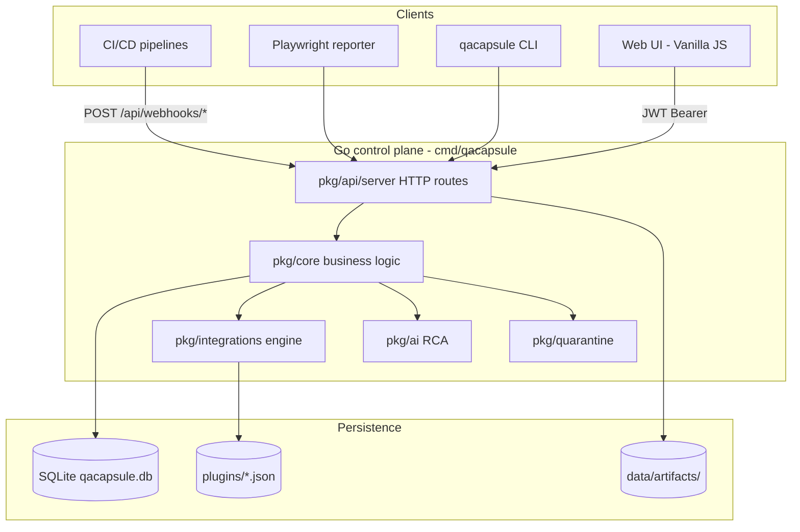
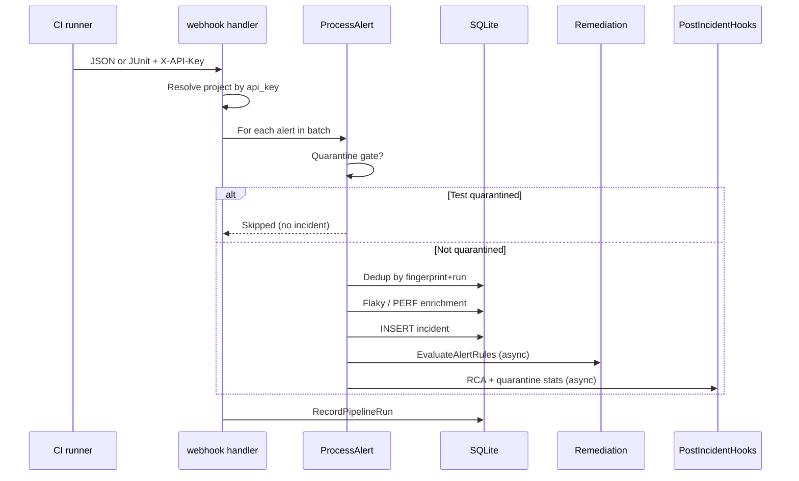

# System Architecture

This document explains **how QA Capsule is built**, how data flows from CI/CD to remediation, and how each major package cooperates. It is written for Staff SREs, platform engineers, and contributors who need to reason about behavior without reading every source file.

!!! tip "Visual reference"
    For **all design schemas** (C4, ER, sequences, state machines, RBAC, deployment), see **[Design Schemas & Diagrams](design-diagrams.md)** — 18 Mermaid diagrams.

---

## Design goals

| Goal | Implementation |
|------|----------------|
| **Zero regression on ingest** | Webhook contract stable; new features are additive (columns, tables, optional JSON fields). |
| **Single-process control plane** | Go HTTP server + SQLite; no mandatory Redis/Kafka for community edition. |
| **Native remediation** | Integrations run in Go (`pkg/integrations`); manifests under `plugins/` — no shell orchestration in production paths. |
| **Tenant isolation** | Projects (gateways) + teams; JWT RBAC on UI APIs; `X-API-Key` on webhooks. |
| **Progressive remediation** | Legacy linear AUTO-RUN coexists with per-project **visual workflow DAGs** (`sre_workflow_json`). |

---

## High-level topology

---

## Repository layout

| Path | Responsibility |
|------|----------------|
| `cmd/qacapsule/` | Main server entry: load config, init DB, init remediation registry, init Super-App (AI + quarantine), start HTTP server. |
| `cmd/cli/` | Developer CLI (`qacapsule run`, flaky checks). |
| `pkg/api/server/` | Route registration, JWT middleware, handlers (webhooks, incidents, workflow, intelligence, DORA, runbooks, plugins). |
| `pkg/core/` | Domain logic: ingest, incidents, projects, routing, workflow persistence, DORA, pipeline runs, RBAC, migrations. |
| `pkg/integrations/` | Plugin registry, linear `Engine`, `WorkflowEngine` DAG walker, runbook templates, condition evaluation. |
| `pkg/ai/` | LLM providers (OpenAI, Ollama), async RCA jobs, report storage. |
| `pkg/quarantine/` | Test stability stats, deny-list entries, CI export API. |
| `pkg/storage/` | Artifact file storage abstraction. |
| `web/` | Static SPA: `app.js` module loader, views per feature, Drawflow workflow editor. |
| `plugins/` | Integration manifests (`*.json`) consumed at startup. |
| `docs/` | MkDocs Material site (this documentation). |

---

## Runtime bootstrap sequence

1. **`core.LoadConfig()`** — reads `config.yaml` (port, SMTP, security, plugins directory).
2. **`core.InitRemediationEngine(pluginsDir)`** — scans `plugins/`, builds `integrations.Registry`, wraps `integrations.Engine`.
3. **`core.InitDB("data/qacapsule.db")`** — opens SQLite, runs `runSchemaMigrations()` (idempotent `ALTER` / `CREATE IF NOT EXISTS`).
4. **`core.InitSuperApp()`** — wires `quarantine.Engine` + `ai.Service` with SQLite repositories.
5. **`server.Start(config)`** — registers all HTTP routes, `InitJWT`, serves `./web` as static files.

If any step fails at startup (e.g. plugins directory missing), the process exits before listening.

---

## Authentication and authorization

### UI sessions (JWT)

- Login: `POST /api/login` → signed JWT (`Claims`: username, role, `require_password_change`).
- Protected routes use `jwtAuthMiddleware` with minimum role (`observer` < `lead` < `manager` < `admin`).
- Secret: `security.jwt_secret` in config or env `QACAPSULE_JWT_SECRET` (dev fallback logs a warning).

### CI ingestion (`X-API-Key`)

- Each **project** (gateway) has a unique `api_key` in `projects`.
- Webhooks and `GET /api/ci/quarantine` validate this header; no JWT.

### Project scoping

- **Admin / Manager**: all projects.
- **Lead / Observer**: projects whose `team_id` matches a `user_teams` row for the user.

---

## Data model (SQLite)

### Core operational tables

| Table | Purpose |
|-------|---------|
| `incidents` | One row per ingested failure (or perf alert). Fingerprint, logs, resolution, `pipeline_run_id`, dimensions (`browser`, `os`, …), RCA flags. |
| `projects` | Gateway definition: `api_key`, legacy routing columns, `sre_routing_json`, `sre_workflow_json`. |
| `pipeline_runs` | One row per webhook batch run (`X-Run-Id`): commit, branch, outcome. |
| `test_execution_metrics` | Passed-test timings for perf regression detection. |

### Super-App tables

| Table | Purpose |
|-------|---------|
| `ai_provider_config` | LLM provider, model, enabled flag. |
| `ai_analysis_jobs` | Per-incident async job status. |
| `incident_rca_reports` | Stored RCA summary text. |
| `test_quarantine_entries` | Active deny-list per test identity fingerprint. |
| `test_stability_stats` | Pass/fail/flaky counters per test. |
| `test_state_transitions` | Audit trail of status changes. |
| `external_signals` | Prometheus/Alertmanager ingests. |
| `external_signal_correlations` | Links signals to incidents (±15 min window). |

### Fingerprinting

- **Incident fingerprint**: `SHA-256(normalized_test_name + "|" + error_message)`.
- **Quarantine identity**: derived from `project_name` + normalized test name (strips `[FLAKY]` prefix for stability).

---

## Ingestion pipeline (detailed)

**Entry:** `POST /api/webhooks/{project}` or `POST /api/webhooks/upload` (JUnit XML).

### Dedup rule

Same `fingerprint` + `project_name` + `pipeline_run_id` within one ingest → **skipped** (no second row).

### Flaky detection

If the same fingerprint was **resolved** in the last **48 hours**, the new failure is prefixed `[FLAKY]` and flagged in logs.

### Performance regression

On `PASSED` with `execution_time_ms`, compare to 30-day average; if > 150%, create `[PERF]` incident with `PERF_DEGRADATION` status.

### Quarantine gate (ingest)

Before insert, `IsTestQuarantined(project, testName)` checks `test_quarantine_entries`. If active:

- **No** incident row, **no** remediation, **no** RCA.
- Stability transition still recorded asynchronously.
- Webhook response includes `quarantined_skipped` count.

---

## Remediation: two modes

### Mode A — Legacy linear AUTO-RUN

Active when `sre_workflow_json` is empty or `enabled: false`.

1. `Engine.EvaluateAlertRules` scans all manifests with `auto_run: true` and `status: active`.
2. `trigger_on` keywords matched against alert text (lowercased concat of name + error + console).
3. **Allowed paths** from `sre_routing_json`:
   - `nil` → no filter (all auto_run plugins eligible).
   - empty map `{}` → **block all** (explicit empty gateway config).
   - non-empty → whitelist by `file_path`.
4. Each match runs in a goroutine with global concurrency cap (`RunRemediationAsync`, max 32).

### Mode B — Visual workflow DAG

Active when `integrations.IsWorkflowActive(doc)` (`enabled: true`, valid `entry`, nodes).

1. `WorkflowEngine.Execute` walks from `entry` node.
2. **Trigger** → follow all outgoing edges (no `when`).
3. **Condition** → evaluate `when` expression → follow `when: "true"` or `when: "false"` edges only.
4. **Action** → if allowed on gateway, `runManifest` for `file_path`; on skip/failure **continue** downstream edges (no abort).
5. Cycle detection: visited set per branch; log warning and stop that path.
6. Context timeout: **2 minutes** per workflow execution.

### Dry-run simulation

`POST /api/projects/{id}/workflow/simulate` calls `PlanExecution` — returns `visited`, `actions`, `skipped` without calling external APIs. Accepts optional `workflow` JSON from the canvas (unsaved draft).

---

## Condition language (`EvaluateCondition`)

| Operator | Example |
|----------|---------|
| `tag` + `prefix` | `[FLAKY]` in incident name |
| `status` + `eq` | `CRITICAL` |
| `text` + `contains` | `timeout` in error |
| `and` / `or` | Nested sub-expressions |

Tags `[FLAKY]` and `[PERF]` are also derived in `DeriveTags(name)` for workflow context.

---

## AI RCA (async)

After insert (non-quarantined, non-flaky-only path for enqueue):

1. `AIService.EnqueueForIncident` spawns goroutine with 2 min timeout.
2. If AI disabled → job marked skipped after `CreateJob`.
3. On failure status → LLM prompt with logs → `incident_rca_reports` + job status.

Does **not** block webhook response.

---

## Quarantine engine

**After each incident** (`PostIncidentHooks`):

1. `RecordTransition` updates `test_stability_stats`.
2. If `auto_quarantine` policy matches (flaky tag, consecutive failures, same-commit flip) → `test_quarantine_entries` row.

**CI consumption:** `GET /api/ci/quarantine?project=name` returns active tests so pipelines can skip or mark them.

---

## DORA and external signals

On each webhook batch:

- `RecordPipelineRun` with outcome `failure` if any incident processed, else `success`.
- DORA metrics computed from `pipeline_runs` + `incidents` (median lead time, MTTR, change failure rate).

**Prometheus:** `POST /api/webhooks/prometheus?project=…` stores `external_signals` and correlates to incidents in the same project within ±15 minutes.

---

## Runbooks

Templates in `pkg/integrations/runbooks.go` are validated workflow documents (registry paths only).

- `GET /api/runbooks/templates` — catalog.
- `POST /api/runbooks/apply` — writes `sre_workflow_json` and enables DAG for a project.

---

## Frontend architecture

| Module | Role |
|--------|------|
| `web/app.js` | Bootstraps app, binds all `window.*` handlers for inline HTML `onclick`. |
| `web/js/api.js` | JWT fetch wrapper, offline detection. |
| `web/js/roles.js` | RBAC helpers + `applyRoleVisibility`. |
| `web/js/settings.js` | CI/CD Gateways table, SRE routing matrix, workflow button. |
| `web/js/workflow-editor.js` | Drawflow canvas ↔ canonical DAG JSON. |
| `web/js/rca.js` | RCA insights view + AI config panel. |
| `web/js/quarantine.js` | Deny-list management. |
| `web/js/runbooks.js` | Template apply UI. |
| `web/js/dora.js` | Manager DORA charts. |
| `web/js/about.js` | In-app Help Center topics. |

No React/Vue — ES modules loaded once from `index.html`.

---

## Concurrency and back-pressure

| Workload | Mechanism |
|----------|-----------|
| Webhook HTTP | Synchronous DB insert; remediation async. |
| Plugin / workflow runs | `RunRemediationAsync` semaphore (32 slots). |
| RCA / quarantine hooks | Separate goroutines with timeouts. |
| UI polling | Incidents every 5s when dashboard active. |

---

## Configuration surfaces

| Surface | What it controls |
|---------|------------------|
| `config.yaml` | Server port, SMTP, security, plugins directory. |
| `projects.sre_routing_json` | Per-gateway plugin allow-list + routing values (`SLACK_CHANNEL`, …). |
| `projects.sre_workflow_json` | Visual DAG + Drawflow UI snapshot. |
| `plugins/*.json` | Integration metadata, `auto_run`, `trigger_on`, env var names. |
| `ai_provider_config` | LLM provider (UI: RCA & AI Insights). |

---

## Failure modes and observability

- Ingest DB errors → logged, alert skipped (no silent duplicate on dedup failure).
- Unknown plugin path in workflow → action skipped at runtime, logged.
- JWT missing/invalid → `401` on UI APIs.
- Structured logs via `log/slog` (Go 1.21+).

---

## Extension points

1. **New integration** — add `plugins/<vendor>/<name>.json` + Go client in `pkg/integrations/`, reload registry.
2. **New workflow condition** — extend `EvaluateCondition` in `pkg/integrations/workflow.go`.
3. **New runbook** — add template to `runbooks.go`, validate paths against registry.
4. **Enterprise** — hooks in `server.go` for FinOps PRO, SSO (`SSOLoginHandler` variable).

---

## Related documentation

- [Platform user guide](platform-user-guide.md) — step-by-step feature usage.
- [Visual Workflow Builder](../plugins/visual-workflow.md) — DAG authoring.
- [CI/CD Overview](../integration/cicd-overview.md) — webhook integration.
- [RBAC & Teams](../setup/rbac-teams.md) — roles matrix.
