# Design Schemas & Diagrams

Reference architecture for **QA Capsule**. All diagrams use [Mermaid](https://mermaid.js.org/); they render in MkDocs Material and on GitHub.

Related narrative: [System Architecture](architecture.md) · [Platform User Guide](platform-user-guide.md)

---

## 1. System context (C4 Level 1)

Who interacts with the system and which external systems are called.

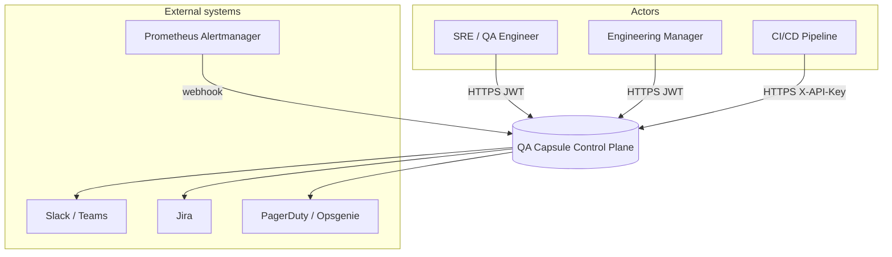

---

## 2. Containers (C4 Level 2)

Logical containers inside a single QA Capsule process (Docker or bare metal).

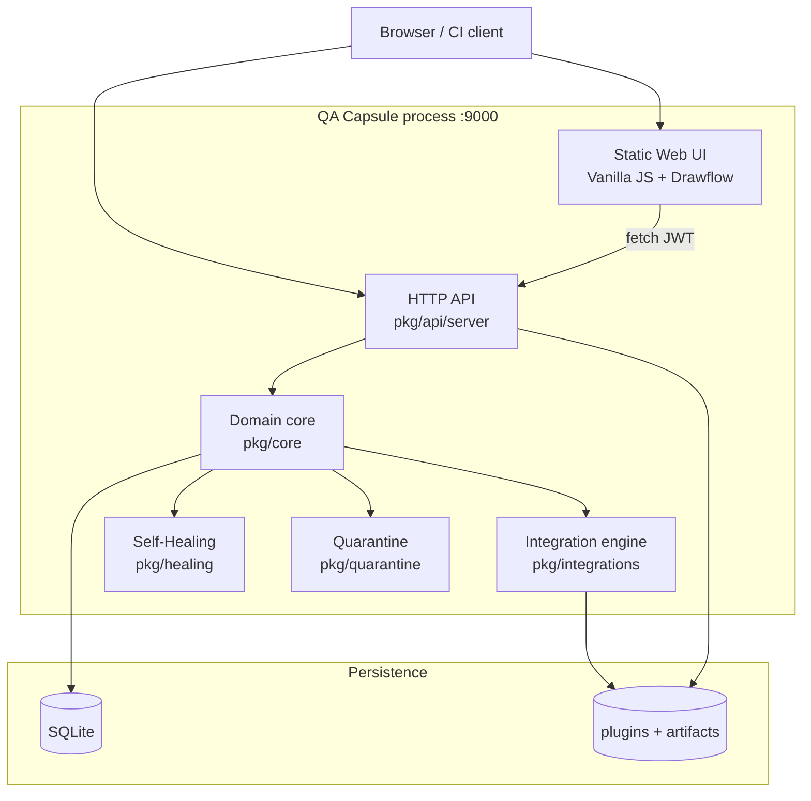

---

## 3. Component diagram — Go packages

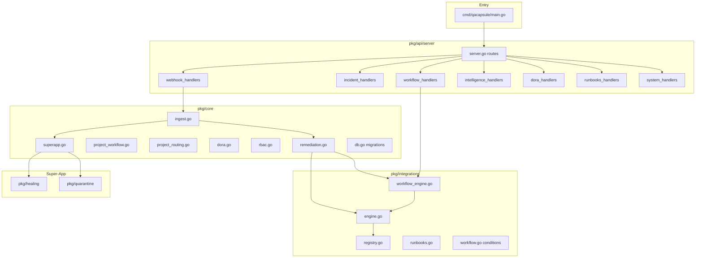

---

## 4. Deployment diagram

Typical **Docker Compose** or bare-metal deployment.

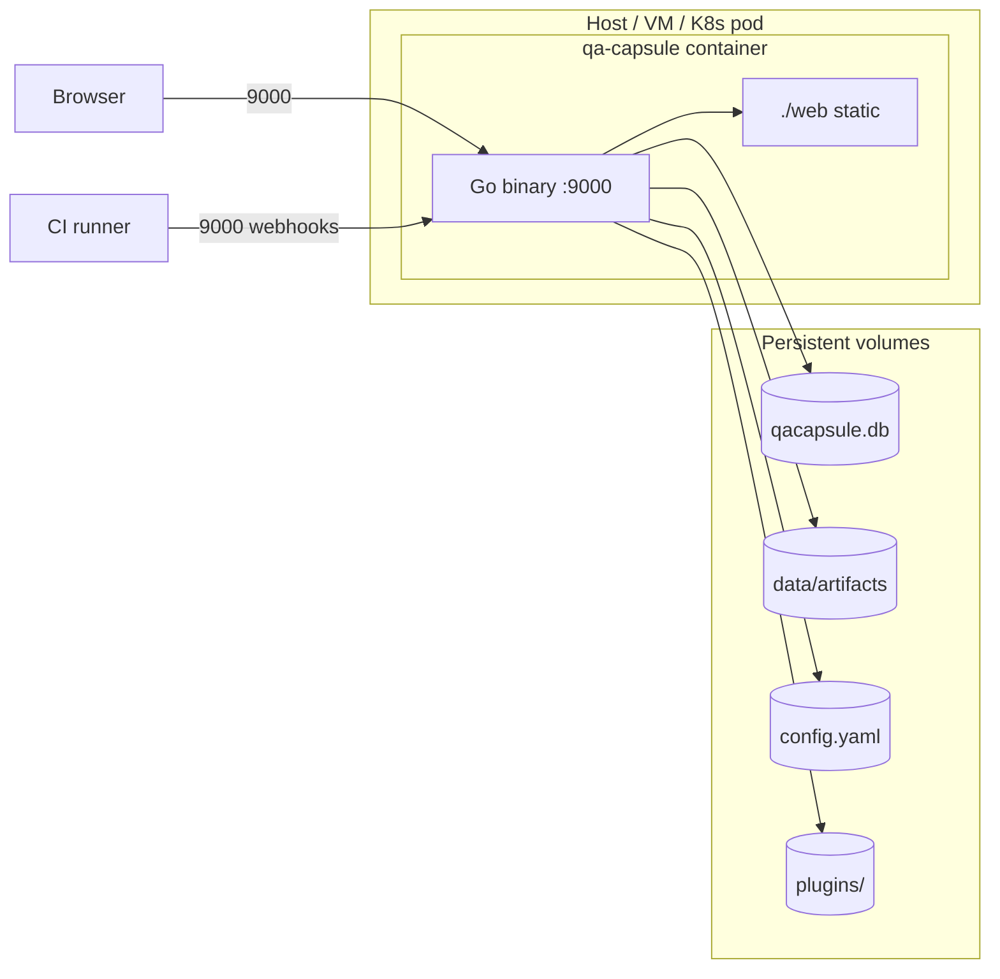

| Port / path | Purpose |
|-------------|---------|
| `:9000` | HTTP — UI + API |
| `./data/qacapsule.db` | SQLite (mount for persistence) |
| `./config.yaml` | Server, SMTP, security, plugins dir |
| `./plugins/` | Integration manifests (optional bind-mount) |
| `./data/artifacts/` | Uploaded traces/screenshots |

---

## 5. Entity-relationship — core data model

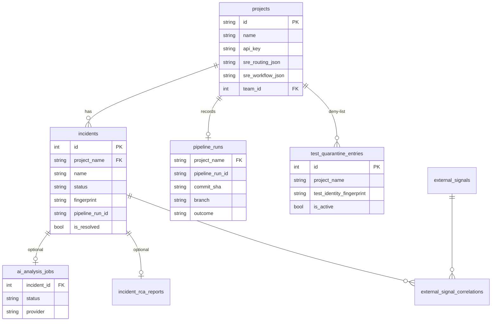

---

## 6. Sequence — Webhook ingest (full path)

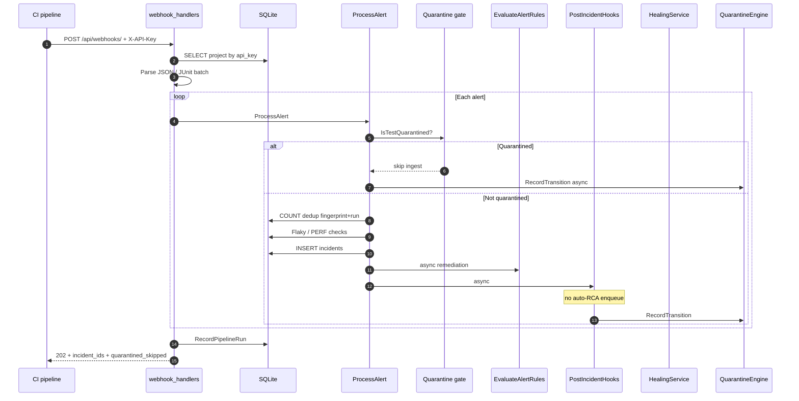

---

## 7. Sequence — Remediation mode selection

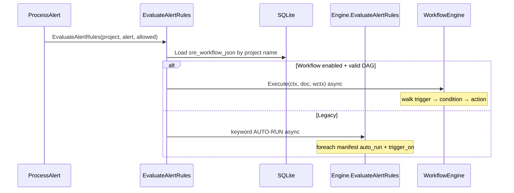

---

## 8. Activity — WorkflowEngine branch walk

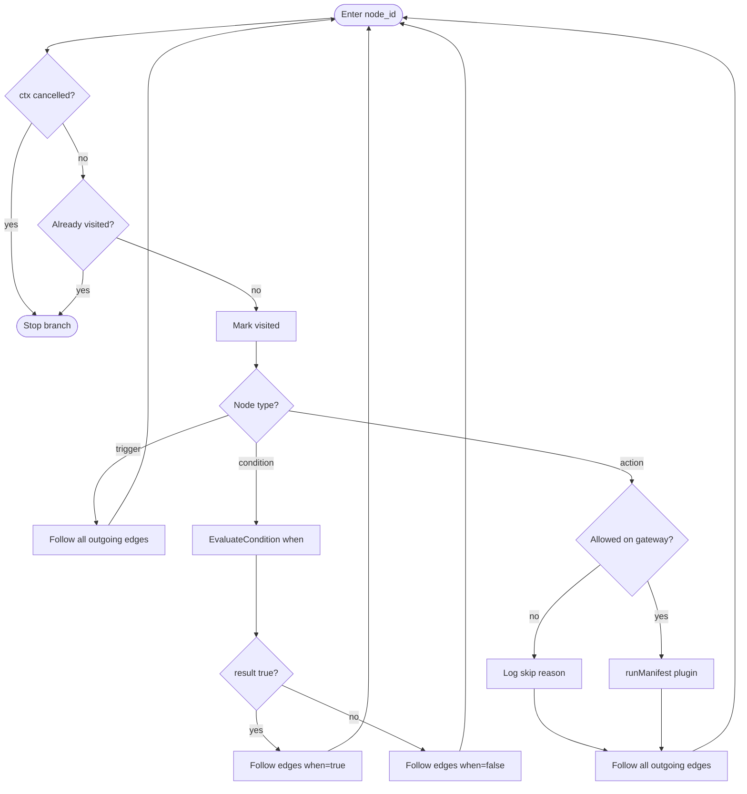

---

## 9. State — Gateway workflow modes

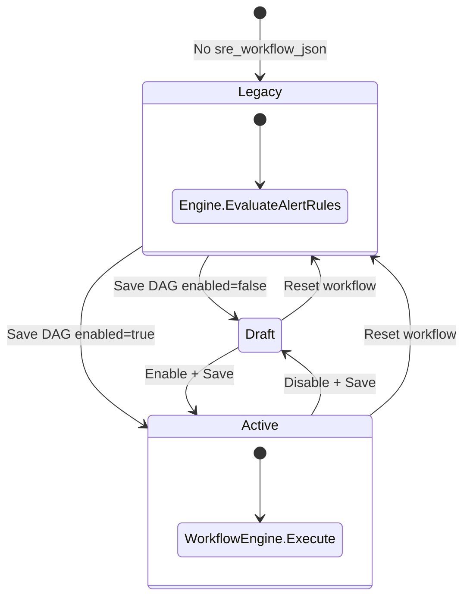

---

## 10. State — Incident lifecycle (UI)

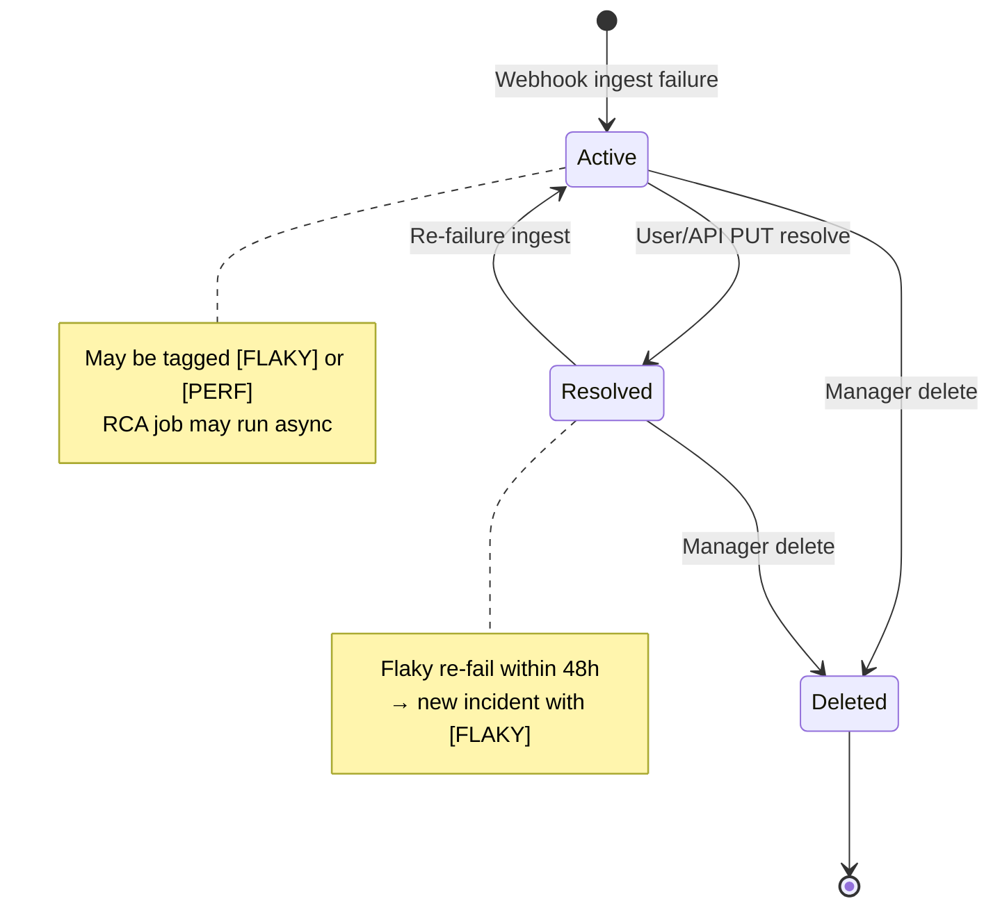

---

## 11. Sequence — Self-healing MCP flow

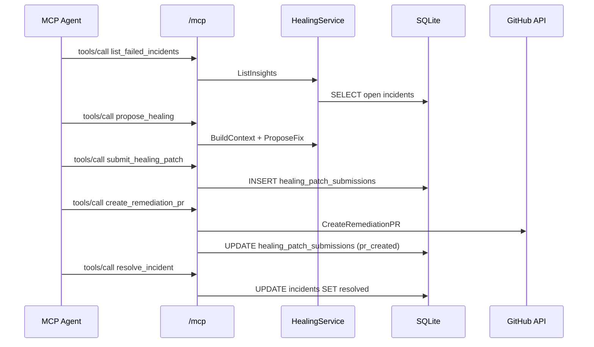

---

## 12. Sequence — Quarantine at ingest

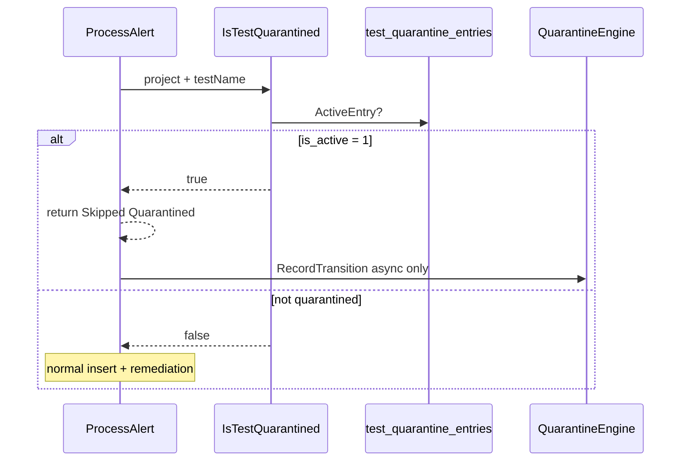

---

## 13. RBAC — Role vs capability matrix

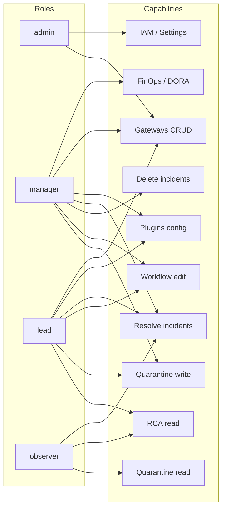

| Capability | admin | manager | lead | observer |
|------------|:-----:|:-------:|:----:|:--------:|
| Operations dashboard | ✓ | ✓ | ✓ | read |
| Resolve incidents | ✓ | ✓ | ✓ | — |
| Delete incidents | ✓ | ✓ | — | — |
| CI/CD Gateways | ✓ | ✓ | ✓ | — |
| Workflow editor | ✓ | ✓ | ✓ | read |
| Plugin Engine | ✓ | ✓ | ✓ | — |
| FinOps | — | ✓ | — | — |
| DORA | — | ✓ | — | — |
| RCA insights | ✓ | ✓ | ✓ | read |
| Quarantine manage | ✓ | ✓ | ✓ | — |
| AI config | ✓ | ✓ | — | — |
| IAM / Teams | ✓ | partial | — | — |

---

## 14. Frontend — module architecture

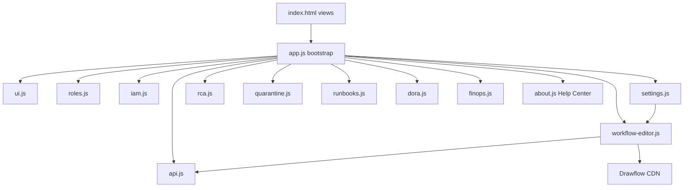

---

## 15. Plugin registry — load and execute

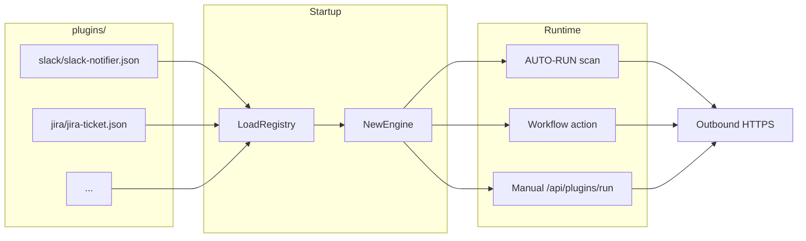

---

## 16. DORA & Prometheus — data flow

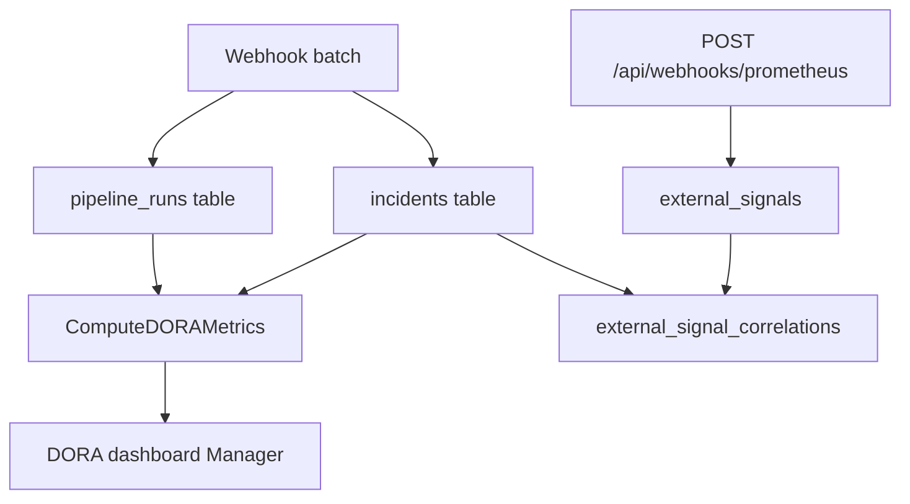

---

## 17. Visual workflow — canonical JSON vs Drawflow UI

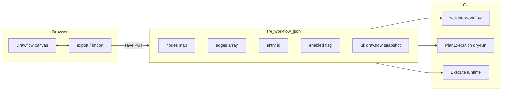

---

## 18. Runbook apply flow

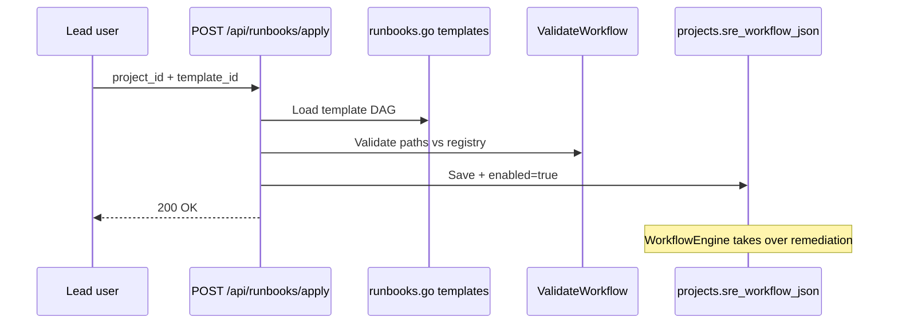

---

## Diagram index

| # | Diagram | Use when |
|---|---------|----------|
| 1 | C4 Context | Stakeholder presentations |
| 2 | C4 Containers | Onboarding / ops |
| 3 | Go components | Contributing code |
| 4 | Deployment | Docker / K8s planning |
| 5 | ER model | SQL / reporting |
| 6 | Ingest sequence | Debugging webhooks |
| 7 | Remediation selection | Workflow vs legacy |
| 8 | Workflow walk | DAG behavior |
| 9–10 | State machines | Gateway + incident |
| 11–12 | Healing MCP / Quarantine | Super-App hooks |
| 13 | RBAC | Access design |
| 14 | Frontend modules | UI changes |
| 15 | Plugins | Integration authors |
| 16 | DORA | Executive metrics |
| 17 | Workflow JSON | Editor/API contract |
| 18 | Runbooks | Template apply |

---

## Exporting diagrams

- **MkDocs:** `mkdocs serve` — Mermaid renders automatically.
- **GitHub:** Mermaid blocks in markdown render natively.
- **PNG/SVG:** Use [Mermaid Live Editor](https://mermaid.live) or `mmdc` CLI to export from this page.
