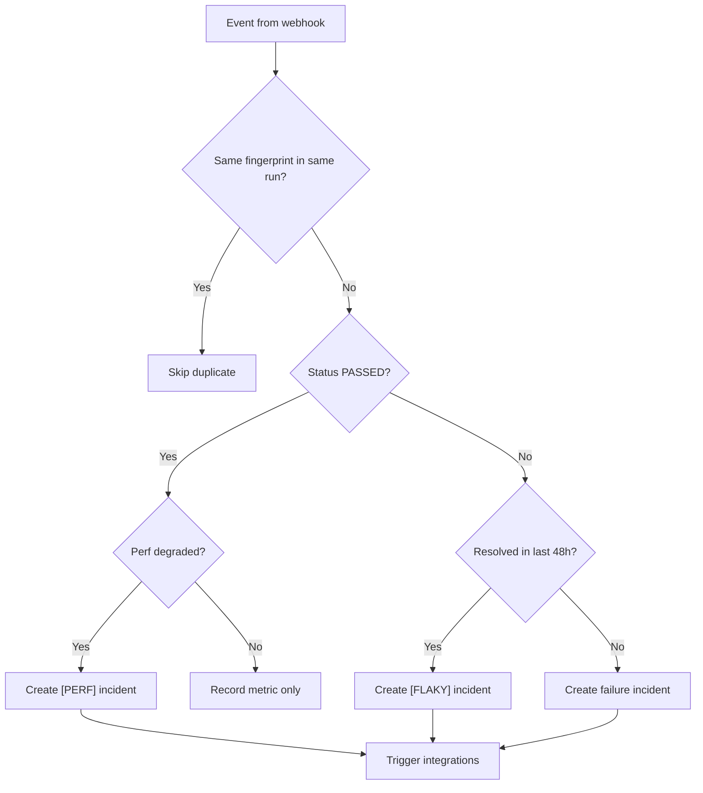

# Incident Lifecycle & Correlation Engine

How QA Capsule creates, deduplicates, tags, resolves, and suppresses incidents.

---

## Incident states

| State | `is_resolved` | UI | Notes |
|---|---|---|---|
| **Active** | `0` | Red / ACTIVE | Deduped per run + fingerprint |
| **Resolved** | `1` | Green / RESOLVED BY | Stays resolved on CI re-ingest |

Prefixes on `name`:

| Prefix | Meaning |
|---|---|
| `[FLAKY]` | Failed again within 48h after resolution |
| `[PERF]` | Passed but execution time > 150% of 30-day average |

---

## Fingerprinting

```
fingerprint = SHA256(name + "|" + error_message)
```

| Scenario | Result |
|---|---|
| Same name + same error | Same fingerprint |
| Same name + different error | New fingerprint |
| Different test | New fingerprint |

---

## Per-pipeline deduplication

Within one CI execution, duplicate `(fingerprint, project_name, pipeline_run_id)` rows are skipped.

Send a stable run id:

```http
X-Run-Id: github-actions-12345678
```

If omitted, the server generates `run-<nanoseconds>`.

---

## Ingestion decision tree



---

## Flaky test detection

When a fingerprint was **resolved** in the last **48 hours** and fails again:

```
[FLAKY] checkout.spec - payment button visible
```

- Yellow badge in dashboard
- Separate FinOps / chart metrics
- Integrations can match `trigger_on: ["FLAKY", "flaky"]`

### CLI lookup

Developers can query production flaky history:

```
GET /api/incidents/check-flaky/{fingerprint}
```

See [Artifacts & CLI](artifacts-and-cli.md).

---

## Performance regression

For **`PASSED`** tests with `execution_time_ms`:

1. Sample inserted into `test_execution_metrics`.
2. Compared to 30-day average for `(project_name, fingerprint)`.
3. If current > **150%** of average → incident with `[PERF]` prefix and `PERF_DEGRADATION` status.

This surfaces slow-but-green tests before they become outages.

---

## Jira association

Test names may include:

- `@jira-SCRUM-42`
- `@SCRUM-42`

Stored as `jira_issue_key` and forwarded to the Jira integration on auto-trigger.

---

## Manual resolution

### Dashboard

1. Select incident(s) → **Resolve**.
2. `PUT /api/incidents` with `{ "ids": [...] }`.
3. `resolved_by`, `resolved_at` set in SQLite.

### API

```bash
curl -X PUT "http://localhost:9000/api/incidents" \
  -H "Authorization: Bearer ${TOKEN}" \
  -H "Content-Type: application/json" \
  -d '{"ids": [42]}'
```

---

## Artifacts

After ingestion, attach evidence:

```
POST /api/incidents/{id}/artifacts
```

See [Artifacts & CLI](artifacts-and-cli.md).

---

## Pipeline grouping (UI)

Grouped when:

- Same `project_name`
- `created_at` within 120 seconds
- `id` within 100 of each other

---

## MTTR

```sql
AVG(resolved_at - created_at) in minutes
WHERE is_resolved = 1
```

---

## Related

- [Webhooks API](../api/webhooks.md)
- [Incidents API](../api/incidents-api.md)
- [Plugin Engine](../plugins/overview.md)
