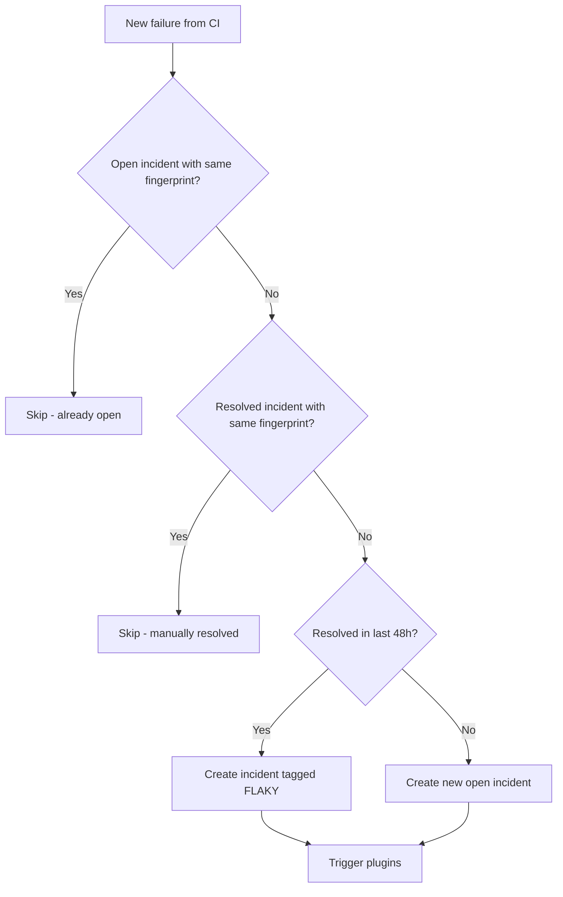

# Incident Lifecycle & Correlation Engine

Understanding how QA Capsule creates, deduplicates, resolves, and suppresses incidents is essential for operating the platform effectively.

---

## Incident States

| State | `is_resolved` | UI appearance | CI re-ingestion |
|---|---|---|---|
| **Active** | `0` | Red border, `ACTIVE TEST` badge | Duplicates suppressed (same fingerprint) |
| **Resolved** | `1` | Green border, `RESOLVED BY {user}` | Duplicates suppressed (same fingerprint) |

There is no automatic re-open. If a genuinely new failure occurs (different error text → different fingerprint), a new incident is created.

---

## Fingerprinting Algorithm

Every incident receives a SHA-256 fingerprint computed from:

```
fingerprint = SHA256(test_name + "|" + error_message)
```

| Scenario | Result |
|---|---|
| Same test, same error | Same fingerprint → deduplicated |
| Same test, different error | Different fingerprint → new incident |
| Different test | Different fingerprint → new incident |

---

## Ingestion Decision Tree



---

## Flaky Test Detection

If a fingerprint was **resolved** within the last **48 hours** and fails again, the new incident is prefixed:

```
[FLAKY] checkout.spec - payment button visible
```

Flaky incidents:

- Appear in the dashboard with a yellow `FLAKY` badge
- Are counted separately in FinOps metrics (`flaky_tests`, `flaky_minutes_lost`)
- Still trigger plugins on `CRITICAL` status

---

## Manual Resolution Flow

### Via Dashboard

1. User selects sub-alert(s) or an entire pipeline group.
2. Frontend calls `PUT /api/incidents` with `{ "ids": [1, 2, 3] }`.
3. SQLite updates: `is_resolved = 1`, `resolved_by = username`, `resolved_at = CURRENT_TIMESTAMP`.
4. Client stores pending resolution in `sessionStorage` until server confirms.
5. Polling merges confirmed state; green badge persists permanently.

### Via REST API

```bash
curl -X PUT "https://sre.yourcompany.com/api/incidents" \
  -H "Authorization: Bearer ${JWT_TOKEN}" \
  -H "Content-Type: application/json" \
  -d '{"ids": [42, 43]}'
```

See [Incidents API](../api/incidents-api.md) for full reference.

---

## Why Resolved Incidents Stay Resolved

**Problem (previous behavior):** CI pipelines that re-run every 5 minutes would re-create incidents after manual resolution, making sub-alerts appear active again.

**Solution (current behavior):** The webhook ingestion checks for resolved fingerprints and skips creation:

```sql
SELECT id FROM incidents
WHERE fingerprint = ? AND project_name = ? AND is_resolved = 1
```

This means:

- Acknowledging a failure in QA Capsule is a durable action.
- CI can continue sending the same XML; the dashboard stays green.
- A **new** failure (different stack trace / error message) still creates a new incident.

---

## Pipeline Grouping Rules

Incidents are grouped in the UI when:

```
same project_name
AND |created_at_diff| <= 120 seconds
AND |id_diff| <= 100
```

This groups sub-alerts from a single CI run without merging unrelated historical failures.

---

## Deletion vs Resolution

| Action | Who | Effect |
|---|---|---|
| **Resolve** | Admin, Operator | Marks `is_resolved = 1`; record kept for MTTR |
| **Delete** | Admin only | Permanently removes from SQLite |

Deletion is irreversible. Use resolve for normal SRE workflow.

---

## MTTR Calculation

Mean Time To Resolution is computed as:

```sql
AVG((resolved_at - created_at) in minutes)
WHERE is_resolved = 1
  AND resolved_at IS NOT NULL
  AND duration >= 1 minute
```

Displayed on the dashboard KPI card and in the Analytics panel.
