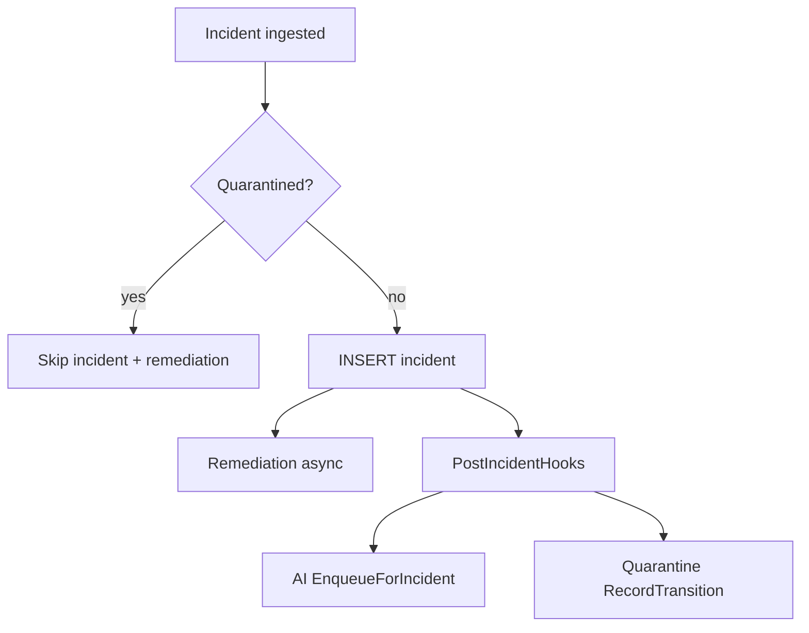
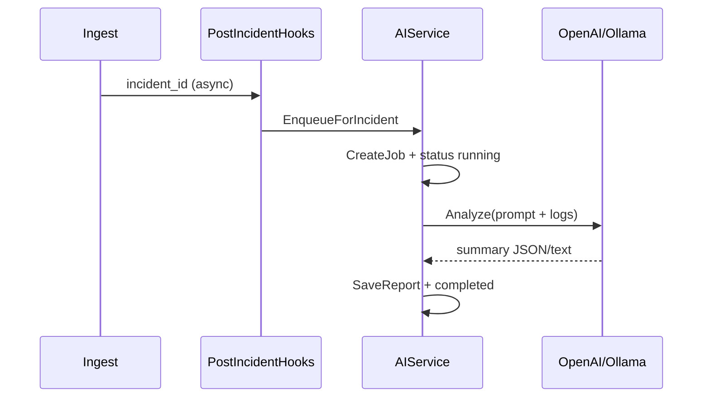

# AI RCA & Quarantine (Detailed)



More diagrams: [Design Schemas & Diagrams](design-diagrams.md) §11–12.

---

## AI Root Cause Analysis

### Purpose

Turn raw failure logs into a **short human summary** (probable cause, impact, suggested next steps) without blocking CI ingest.

### Configuration (Manager+)

| Field | Description |
|-------|-------------|
| Provider | `openai`, `ollama`, or `disabled` |
| Model | e.g. `gpt-4o-mini`, `llama3.2` |
| Base URL | Ollama default `http://localhost:11434` |
| API key env | Name of env var on server (e.g. `OPENAI_API_KEY`) |
| Enabled | Master switch |

Stored in table `ai_provider_config` (single row).

### Runtime flow



- **Skipped** when AI disabled, non-failure status, or job policy says so.
- **Failed** jobs may still store a stub summary explaining the provider error.
- Flaky-only paths may skip enqueue to reduce noise (see `superapp.go`).

### UI usage (Lead+)

1. Open **RCA & AI Insights**.
2. Browse recent reports (project filter).
3. Open incident → view full RCA text.
4. **Re-run analysis** if logs were updated.

### API

| Method | Path | RBAC |
|--------|------|------|
| GET | `/api/rca/insights?project=` | Lead, Manager, Observer |
| GET | `/api/incidents/{id}/rca` | Team access to incident |
| POST | `/api/incidents/{id}/rca` | Lead+ (re-trigger) |
| GET/PUT | `/api/ai/config` | GET Lead+; PUT Manager+ |

---

## Smart Quarantine (DenyList)

### Purpose

1. **Suppress** remediation noise for known-bad tests.
2. **Export** deny-list to CI so pipelines can skip tests before execution.

### Data model

| Entity | Description |
|--------|-------------|
| `test_identity_fingerprint` | Stable key per project + normalized test name |
| `test_quarantine_entries` | Active deny rows with reason (`flaky`, `manual`, …) |
| `test_stability_stats` | Pass/fail/flaky counters, consecutive failures |
| `test_state_transitions` | Audit log per ingest |

### Auto-quarantine policy (defaults)

Triggers when (simplified):

- Incident ingested with `[FLAKY]` tag, or
- Flaky counter ≥ threshold, or
- Consecutive failures ≥ threshold, or
- Same commit failed after recent pass (configurable)

### Manual operations (Lead+)

| Action | Effect |
|--------|--------|
| **Add** | Creates active quarantine row immediately |
| **Lift** | Deactivates row; test ingests normally again |
| **List** | Filter by project in UI |

### Ingest gate

When a test is quarantined **before** insert:

- No row in `incidents`.
- No workflow / AUTO-RUN / RCA.
- Webhook response: `"quarantined_skipped": N`.
- Stability stats still updated in background.

### CI API

```http
GET /api/ci/quarantine?project=my-e2e-suite
X-API-Key: <same-as-webhook>
```

Response shape:

```json
{
  "project_name": "my-e2e-suite",
  "generated_at": "2026-05-24T00:00:00Z",
  "tests": [
    {
      "test_name": "checkout payment",
      "test_identity_fingerprint": "...",
      "reason": "flaky",
      "since": "2026-05-23T12:00:00Z"
    }
  ]
}
```

Use in pipeline to `skip` or `mark flaky` before running expensive suites.

### API (JWT)

| Method | Path | RBAC |
|--------|------|------|
| GET | `/api/quarantine?project=` | Lead+ read |
| POST | `/api/quarantine` | Lead+ add |
| DELETE | `/api/quarantine?project=&fingerprint=` | Lead+ lift |

---

## Webhook fields (optional)

JSON body or headers:

- `commit_sha` / `X-Commit-Sha`
- `branch` / `X-Branch`

Used for quarantine same-commit logic and `pipeline_runs` enrichment.

---

## Related

- [Platform User Guide](platform-user-guide.md) §6–7
- [System Architecture](architecture.md) — hook ordering
