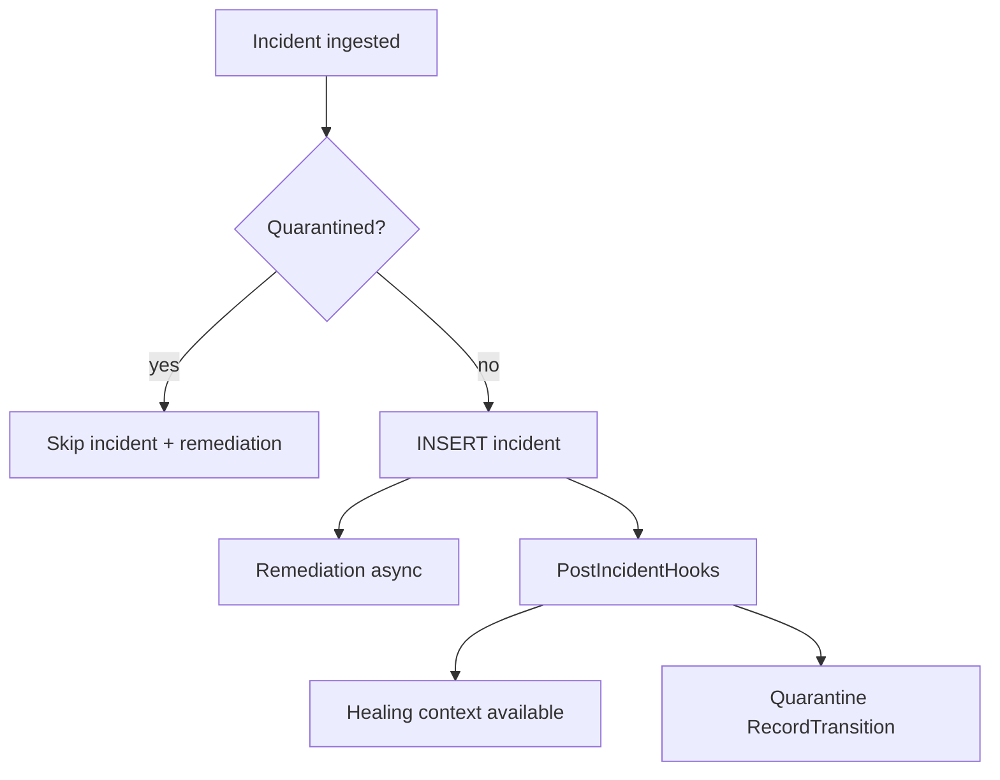
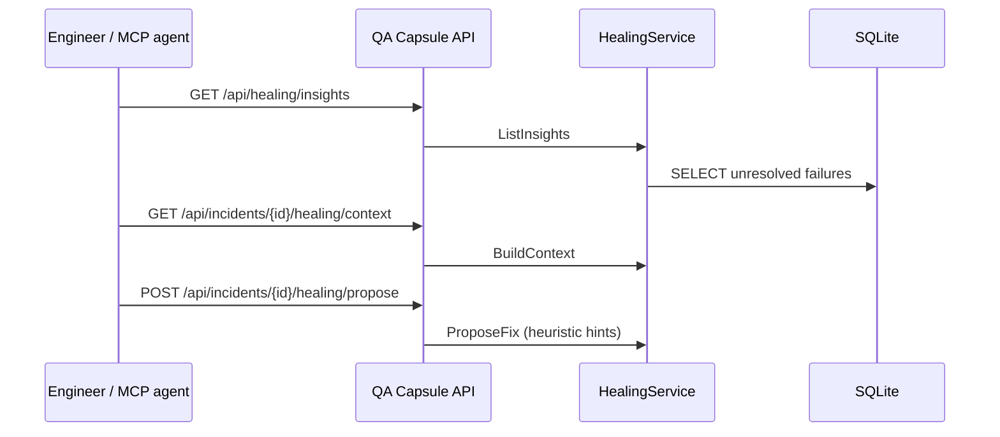

# Self-Healing & Quarantine (Detailed)



More diagrams: [Design Schemas & Diagrams](design-diagrams.md) §11–12.

---

## Self-Healing context

### Purpose

Turn raw failure telemetry into **actionable, framework-agnostic healing guidance** for MCP agents and engineers.

No provider configuration is required in community flow for phase 1/2. Guidance is derived from incident telemetry and heuristics.

### Runtime flow



### UI usage (Observer+)

1. Open **Self-Healing Hub**.
2. Browse open failures by project.
3. Open incident context and copy MCP prompt.
4. Propose patch and create PR from MCP workflow.

### API

| Method | Path | RBAC |
|--------|------|------|
| GET | `/api/healing/insights?project=` | Lead, Manager, Observer |
| GET | `/api/incidents/{id}/healing/context` | Team access to incident |
| POST | `/api/incidents/{id}/healing/propose` | Lead+ |
| POST | `/api/incidents/{id}/healing/pr` | Lead+ |

---

## Smart Quarantine (DenyList)

### Purpose

1. **Suppress** remediation noise for known-bad tests.
2. **Export** deny-list to CI so pipelines can skip tests before execution.

### Data model

| Entity | Description |
|--------|-------------|
| `test_identity_fingerprint` | Stable key per project + normalized test name |
| `test_quarantine_entries` | Active deny rows with reason (`flaky`, `manual`, …) |
| `test_stability_stats` | Pass/fail/flaky counters, consecutive failures |
| `test_state_transitions` | Audit log per ingest |

### Auto-quarantine policy (defaults)

Triggers when (simplified):

- Incident ingested with `[FLAKY]` tag, or
- Flaky counter ≥ threshold, or
- Consecutive failures ≥ threshold, or
- Same commit failed after recent pass (configurable)

### Manual operations (Lead+)

| Action | Effect |
|--------|--------|
| **Add** | Creates active quarantine row immediately |
| **Lift** | Deactivates row; test ingests normally again |
| **List** | Filter by project in UI |

### Ingest gate

When a test is quarantined **before** insert:

- No row in `incidents`.
- No workflow / AUTO-RUN / RCA.
- Webhook response: `"quarantined_skipped": N`.
- Stability stats still updated in background.

### CI API (X-API-Key)

Project is resolved from the API key (same key as webhook ingest). No JWT required.

#### List all quarantined tests

```http
GET /api/ci/quarantine
X-API-Key: <project-api-key>
```

Response shape:

```json
{
  "project_name": "my-e2e-suite",
  "generated_at": "2026-05-24T00:00:00Z",
  "tests": [
    {
      "test_name": "checkout payment",
      "fingerprint": "64-char-hex-test-identity",
      "reason": "flaky",
      "since": "2026-05-23T12:00:00Z"
    }
  ]
}
```

#### Per-test gate (skip before execution)

```http
GET /api/ci/quarantine/status?test=checkout%20payment
X-API-Key: <project-api-key>
```

Or with the stable fingerprint from the list endpoint:

```http
GET /api/ci/quarantine/status?hash=<64-char-hex>
X-API-Key: <project-api-key>
```

Alias (same handler): `GET /api/quarantine/status?…`

Response when quarantined:

```json
{
  "project_name": "my-e2e-suite",
  "quarantined": true,
  "skip": true,
  "test_name": "checkout payment",
  "fingerprint": "...",
  "reason": "flaky",
  "source": "auto",
  "since": "2026-05-23T12:00:00Z",
  "message": "Test is quarantined; skip execution in CI."
}
```

When not quarantined, `quarantined` and `skip` are `false` — run the test normally.

#### GitHub Actions example

```yaml
- name: Skip if quarantined
  env:
    QACAPSULE_URL: https://qa-capsule.example.com
    QACAPSULE_API_KEY: ${{ secrets.QACAPSULE_API_KEY }}
    TEST_NAME: "Checkout.Payment"
  run: |
    resp=$(curl -fsS -H "X-API-Key: $QACAPSULE_API_KEY" \
      "$QACAPSULE_URL/api/ci/quarantine/status?test=$(python -c "import urllib.parse; print(urllib.parse.quote('$TEST_NAME'))")")
    if echo "$resp" | grep -q '"skip":true'; then
      echo "Skipping quarantined test: $TEST_NAME"
      exit 0
    fi
    # run the test step here
```

Fetch the full deny-list once per job if you prefer caching fingerprints locally.

### Repo integration (Robot Framework)

This repository wires the gate automatically:

| File | Role |
|------|------|
| `scripts/quarantine-ci-gate.sh` | `list`, `should-skip`, `robot-tests` helpers |
| `scripts/run-tests.sh` | Skips quarantined Robot test cases before `robot` runs |
| `.github/workflows/e2e-tests-robot.yml` | Prints deny-list, passes secrets into `run-tests.sh` |

Set GitHub secrets `QA_CAPSULE_URL` and `QA_CAPSULE_API_ROBOT_KEY`. To skip a demo failure in CI, quarantine test name **`Simulated Payment Gateway Rejection`** (from `demo_failure.robot`) in the QA Capsule UI or via auto-quarantine after flaky detection.

### Auto-lift

After **5 consecutive passes** (default `AutoLiftAfterPasses`), an auto-quarantined test is lifted so CI and ingest resume without manual action.

### API (JWT)

| Method | Path | RBAC |
|--------|------|------|
| GET | `/api/quarantine?project=` | Lead+ read |
| POST | `/api/quarantine` | Lead+ add |
| DELETE | `/api/quarantine?project=&fingerprint=` | Lead+ lift |

---

## Webhook fields (optional)

JSON body or headers:

- `commit_sha` / `X-Commit-Sha`
- `branch` / `X-Branch`

Used for quarantine same-commit logic and `pipeline_runs` enrichment.

---

## Related

- [Platform User Guide](platform-user-guide.md) §6–7
- [System Architecture](architecture.md) — hook ordering
