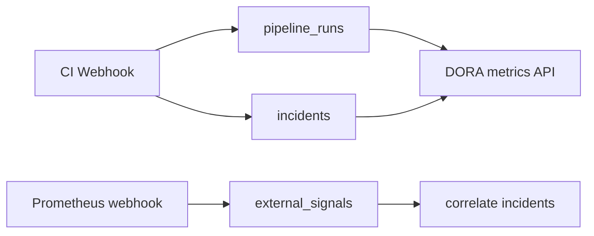

# Runbooks & DORA Metrics (Detailed)



See [Design Schemas & Diagrams](design-diagrams.md) §16, §18.

---

## Runbook templates

### Concept

A **runbook** in QA Capsule is a **pre-validated workflow document** (DAG JSON) shipped in code (`pkg/integrations/runbooks.go`). Applying a runbook:

1. Loads the template workflow.
2. Validates every action `file_path` against the live plugin registry.
3. Writes `projects.sre_workflow_json` for the target gateway.
4. Sets `enabled: true` so the Visual Workflow Engine owns remediation.

Runbooks do **not** execute shell scripts directly — only native Go integrations.

### Built-in templates

| Template ID | Typical trigger logic | Actions (examples) |
|-------------|----------------------|-------------------|
| `502-restart-pod` | Error contains 502 | K8s rollout + Slack |
| `flaky-triage` | Name prefix `[FLAKY]` | Slack + Jira |
| `perf-regression` | Name prefix `[PERF]` | Datadog + Slack |
| `oom-restart` | OOM / CrashLoop in error | K8s restart |
| `timeout-cache-flush` | Timeout in error | Custom webhook |

Exact graph JSON: `GET /api/runbooks/templates?id=<template_id>`.

### UI workflow (Lead+)

1. Navigate to **Runbooks**.
2. Select **gateway** (project).
3. Preview template description and nodes.
4. Click **Apply** — confirm overwrite of existing workflow.
5. Open **WORKFLOW** on gateway to customize.

### API

```http
GET /api/runbooks/templates
GET /api/runbooks/templates?id=flaky-triage
Authorization: Bearer <jwt>
```

```http
POST /api/runbooks/apply
Authorization: Bearer <jwt>
Content-Type: application/json

{
  "project_id": "1",
  "template_id": "flaky-triage",
  "enable": true
}
```

Requires **Lead**, **Manager**, or **Admin**.

---

## DORA dashboard (Manager)

### Four keys

| Metric | Definition in QA Capsule |
|--------|-------------------------|
| **Deployment frequency** | `COUNT(pipeline_runs)` / days in range |
| **Lead time for changes** | **Median** minutes from `pipeline_runs.started_at` to first related `incidents.created_at` |
| **Change failure rate** | Runs with `outcome=failure` / total runs |
| **MTTR** | Mean minutes from incident `created_at` to `resolved_at` (resolved only) |

### Recording pipeline runs

Every webhook batch calls `RecordPipelineRun`:

- `project_name`, `pipeline_run_id`, `commit_sha`, `branch`
- `outcome`: `failure` if any incident created in batch, else `success`
- Timestamps for DORA windows

Ensure CI sends stable `X-Run-Id` per pipeline execution.

### UI

**DORA & Executive Dashboard** view:

- Range selector (7d, 30d, …)
- Optional project filter
- Chart series by week (deployments, CFR)
- External signal count + correlated incidents

### API

```http
GET /api/dora/metrics?range=30d&project=
Authorization: Bearer <jwt>
```

Manager role required.

```http
GET /api/dora/signals?project=
```

Lists ingested Prometheus/Alertmanager signals.

---

## Prometheus / Alertmanager webhook

```http
POST /api/webhooks/prometheus?project=my-e2e-suite
X-API-Key: <gateway-api-key>
Content-Type: application/json

{
  "alerts": [
    {
      "labels": { "alertname": "HighErrorRate", "severity": "critical" },
      "annotations": { "summary": "5xx spike on checkout" },
      "startsAt": "2026-05-24T10:00:00Z"
    }
  ]
}
```

Processing:

1. Insert `external_signals` row per alert.
2. Find incidents in same `project_name` with `created_at` within **±15 minutes**.
3. Insert `external_signal_correlations` for matches.

Use case: correlate infra alerts with test failures on the same timeline.

---

## Executive interpretation

| Pattern | Reading |
|---------|---------|
| High CFR + high MTTR | Instability and slow triage — prioritize runbooks + workflow automation |
| High deployment frequency + low lead time | Healthy delivery cadence |
| Many external signals, few correlations | Alerts may not match test gateway project filter |

---

## Related

- [Platform User Guide](platform-user-guide.md) §8–9
- [System Architecture](architecture.md) — `pipeline_runs`, signals
