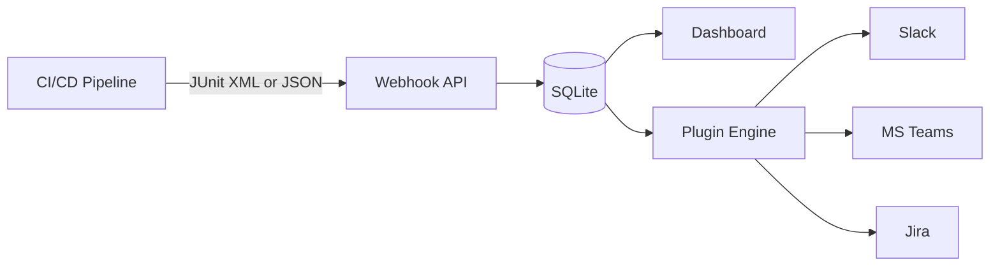

# QA Capsule — SRE Control Plane

**QA Flight Recorder** (QA Capsule) is an enterprise-grade Site Reliability Engineering (SRE) control plane that ingests CI/CD and End-to-End (E2E) test failures, correlates duplicate alerts, routes notifications to the right teams, and tracks resolution metrics in real time.

---

## What Problem Does It Solve?

When a pipeline fails, engineers typically:

1. Open the CI/CD platform and scroll through thousands of log lines.
2. Manually create a Jira ticket.
3. Manually notify Slack or Microsoft Teams.
4. Lose context when the same test fails again on the next run.

**QA Capsule automates this entire workflow** — from ingestion to notification to resolution tracking.

---

## Core Capabilities

| Capability | Description |
|---|---|
| **Smart Correlation** | SHA-256 fingerprinting deduplicates identical failures. Open incidents are not duplicated; resolved incidents are not re-opened by CI re-runs. |
| **Flaky Test Detection** | Tests that failed and were resolved within 48 hours are automatically tagged `[FLAKY]`. |
| **Pipeline Grouping** | Multiple sub-alerts from the same pipeline execution are grouped visually in the dashboard. |
| **Sub-Alert Resolution** | Resolve individual tests or entire pipeline executions from the UI. State persists across polling and CI re-ingestion. |
| **Multi-Tenancy & RBAC** | Hierarchical teams, project-scoped visibility, global roles (Admin, Operator, Viewer). |
| **Plugin Engine** | Bash/Python runbooks triggered on `CRITICAL` alerts — Jira, Slack, Teams, custom remediation. |
| **FinOps Metrics** | MTTR, CI minutes lost, estimated cost impact, weekly health reports. |
| **Universal CI/CD Gateways** | GitHub Actions, GitLab CI, Jenkins, and any custom provider via REST or JUnit XML upload. |

---

## Architecture Overview



1. **Ingestion** — CI pushes JUnit XML (`/api/webhooks/upload`) or JSON (`/api/webhooks/{provider}`).
2. **Parsing** — Go engine extracts test name, error, stdout, stderr, and computes a fingerprint.
3. **Correlation** — Duplicate open incidents are skipped; resolved fingerprints are suppressed.
4. **Routing** — Project API key maps to Slack channel, Teams webhook, Jira project key.
5. **Remediation** — Plugins execute asynchronously; the API returns `202 Accepted` immediately.

---

## Quick Start

```bash
git clone https://github.com/QA-Capsule/qa-capsule-community.git
cd qa-capsule-community
docker compose up -d --build
```

Open **http://localhost:9000** — default login `admin` / `admin` (you will be forced to change the password on first login).

---

## Documentation Map

| Section | What you will learn |
|---|---|
| [Docker Deployment](setup/docker.md) | Production-ready container setup |
| [System Configuration](setup/config.md) | SMTP, domain policy, first admin |
| [RBAC & Teams](setup/rbac-teams.md) | Roles, teams, project access |
| [CI/CD Overview](integration/cicd-overview.md) | How to integrate any pipeline |
| [JUnit XML Upload](integration/junit-xml-upload.md) | **Recommended** ingestion method |
| [Dashboard Guide](guides/dashboard-operations.md) | Filters, sub-alerts, resolve, exports |
| [Incident Lifecycle](guides/incident-lifecycle.md) | Correlation, flaky, persistence |
| [Webhooks API](api/webhooks.md) | JSON payload reference |
| [Incidents API](api/incidents-api.md) | REST API for resolve/delete |

---

## Technology Stack

- **Backend:** Go 1.24+ (embedded SQLite via `modernc.org/sqlite`)
- **Frontend:** Vanilla JavaScript ES6+, Chart.js analytics
- **Deployment:** Docker, Docker Compose
- **Documentation:** MkDocs Material (this site)
