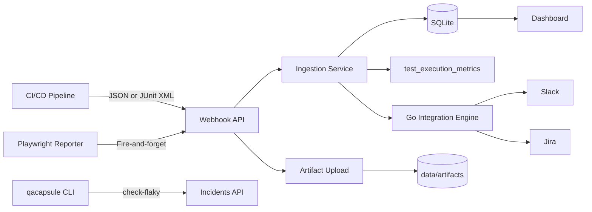

# QA Capsule — SRE Control Plane

**QA Flight Recorder** (QA Capsule) is an enterprise-grade Site Reliability Engineering (SRE) control plane that ingests CI/CD and End-to-End (E2E) test failures, correlates duplicate alerts, stores visual test evidence, routes notifications to the right teams, and tracks resolution metrics in real time.

---

## What Problem Does It Solve?

When a pipeline fails, engineers typically:

1. Open the CI/CD platform and scroll through thousands of log lines.
2. Manually create a Jira ticket.
3. Manually notify Slack or Microsoft Teams.
4. Lose context when the same test fails again on the next run.

**QA Capsule automates this workflow** — from ingestion to notification to resolution tracking, with optional Playwright traces and local developer feedback via CLI.

---

## Core Capabilities

| Capability | Description |
|---|---|
| **Smart Correlation** | SHA-256 fingerprinting (`name\|error`) deduplicates failures per pipeline run (`X-Run-Id`). |
| **Flaky Test Detection** | Re-failure within 48h after resolution → `[FLAKY]` prefix; CLI can query flaky status by hash. |
| **Performance Regression** | `execution_time_ms` on passed tests; alert `[PERF]` when duration exceeds 150% of 30-day average. |
| **Dimensional Tags** | Ingest `browser`, `os`, `viewport`; auto-extract `@jira-PROJ-123` from test names. |
| **Test Artifacts** | Upload trace zips, screenshots, videos per incident (`POST /api/incidents/{id}/artifacts`). |
| **Native Integrations** | Go HTTP engine (Slack, Jira, Teams, PagerDuty, Opsgenie, webhooks, email) — **no shell scripts**. |
| **Plugin Engine** | JSON manifests under `plugins/`; loaded once at startup; manual test from UI. |
| **FinOps & Analytics** | MTTR, CI minutes lost, flaky cost, QCL charts, PDF export. |
| **Developer CLI** | `qacapsule run` wraps local tests and warns on known flaky fingerprints. |
| **Playwright Reporter** | Real-time failure POST + optional trace zip upload. |
| **Multi-Tenancy & RBAC** | Teams, project-scoped visibility, roles: Platform Admin, Manager, Lead, Observer. |
| **Universal CI/CD Gateways** | JSON webhooks, JUnit XML upload, GitHub / GitLab / Jenkins guides. |

---

## Architecture Overview



1. **Ingestion** — `POST /api/webhooks/` (JSON) or `POST /api/webhooks/upload` (JUnit XML).
2. **Enrichment** — Dimensions, Jira tags, execution time, perf regression, flaky tagging.
3. **Correlation** — Fingerprint + `pipeline_run_id` anti-spam per run.
4. **Remediation** — Native Go integrations (async); secrets via env vars preferred over JSON.
5. **Artifacts** — Multipart upload; local storage (S3 stub for future enterprise).

---

## Quick Start

```bash
git clone https://github.com/QA-Capsule/qa-capsule-community.git
cd qa-capsule-community
docker compose up -d --build
```

Open **http://localhost:9000** — default login `admin` / `admin` (password change required on first login).

Build the developer CLI:

```bash
go build -o bin/qacapsule-cli ./cmd/cli
```

---

## Documentation Map

| Section | What you will learn |
|---|---|
| [Docker Deployment](setup/docker.md) | Production-ready container setup |
| [System Configuration](setup/config.md) | SMTP, storage, security policy |
| [RBAC & Teams](setup/rbac-teams.md) | Roles, teams, project access |
| [CI/CD Overview](integration/cicd-overview.md) | Pipeline integration checklist |
| [JUnit XML Upload](integration/junit-xml-upload.md) | Structured multi-test ingestion |
| [Playwright Reporter](integration/playwright-reporter.md) | Real-time reporter + trace upload |
| [Webhooks API](api/webhooks.md) | JSON payload, batch mode, headers |
| [Incidents API](api/incidents-api.md) | Resolve, artifacts, flaky check |
| [Incident Lifecycle](guides/incident-lifecycle.md) | Correlation, flaky, perf alerts |
| [Artifacts & CLI](guides/artifacts-and-cli.md) | Upload, storage, local wrapper |
| [Plugin Engine](plugins/overview.md) | Native Go integrations (manifests) |
| [Plugin configuration guide](plugins/configuration-guide.md) | Two-sided setup (QA Capsule + vendor) with logos |
| [Integrations catalog](plugins/integrations-catalog.md) | All plugins — Slack, Jira, PagerDuty, Datadog, TestRail, … |
| [Dashboard Guide](guides/dashboard-operations.md) | Filters, resolve, exports |

---

## Technology Stack

- **Backend:** Go 1.25+ (`modernc.org/sqlite`, modular `pkg/storage`, `pkg/service`, `pkg/integrations`)
- **CLI:** Cobra (`cmd/cli`)
- **Frontend:** Vanilla JavaScript ES6+, Chart.js
- **Reporter:** TypeScript Playwright custom reporter (`examples/playwright-reporter/`)
- **Documentation:** MkDocs Material (this site)
