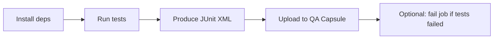

# CI/CD providers — configuration guide

How to wire **any CI/CD platform** to QA Capsule using the same upload contract. Framework-specific report paths are in [Test frameworks](test-frameworks.md).

---

## Provider matrix

| Provider | Variables / secrets store | When to upload | Guide |
|----------|---------------------------|----------------|-------|
| **GitHub Actions** | Settings → Secrets and variables → Actions | Step with `if: always()` | [GitHub Actions](github.md) |
| **GitLab CI** | Settings → CI/CD → Variables | `after_script` | [GitLab CI](gitlab.md) |
| **Jenkins** | Credentials / withCredentials | `post { always { ... } }` | [Jenkins](jenkins.md) |
| **Azure DevOps** | Pipeline variables (secret) | `condition: always()` | Below |
| **CircleCI** | Project Environment Variables | `when: always` | Below |
| **Bitbucket Pipelines** | Repository variables | `after-script` | Below |
| **Buildkite** | Agent hooks / secrets | `exit-handler` | Below |
| **Generic / self-hosted** | Env vars on runner | After test command | [JUnit XML](junit-xml-upload.md) |

**Required values (all providers):**

| Variable | Example |
|----------|---------|
| Base URL | `https://qa-capsule.example.com` |
| API key | From **CI/CD Gateways** (shown once at provision) |

---

## Pattern every provider must follow



1. Run tests with `continue-on-error` / allow failure so XML is still produced.  
2. Upload with `curl` multipart **even if tests failed**.  
3. Optionally fail the job after a successful upload so CI stays red.

---

## GitHub Actions

**Secrets:** `QA_CAPSULE_URL`, `QA_CAPSULE_API_KEY` (or per-framework keys).

```yaml
env:
  QA_CAPSULE_URL: ${{ secrets.QA_CAPSULE_URL }}
  QA_CAPSULE_API_KEY: ${{ secrets.QA_CAPSULE_API_ROBOT_KEY }}

jobs:
  test:
    runs-on: ubuntu-latest
    steps:
      - uses: actions/checkout@v4

      - name: Run tests
        id: tests
        run: ./scripts/run-tests.sh   # or pytest, playwright, etc.
        continue-on-error: true

      - name: Send results to QA Capsule
        if: always()
        env:
          WEBHOOK_URL: ${{ secrets.QA_CAPSULE_URL }}
          API_KEY: ${{ secrets.QA_CAPSULE_API_ROBOT_KEY }}
        run: |
          curl -f -S -X POST "${WEBHOOK_URL}/api/webhooks/upload?framework=RobotFramework" \
            -H "X-API-Key: ${API_KEY}" \
            -H "X-Run-Id: ${{ github.run_id }}" \
            -H "X-Execution-Env: STAGING" \
            -H "X-Execution-Type: TEST-RUN" \
            -F "file=@tests/results/robot-junit.xml"

      - name: Fail job if tests failed
        if: steps.tests.outcome == 'failure'
        run: exit 1
```

**Example workflows in this repo:**

| Workflow file | Framework |
|---------------|-----------|
| `e2e-tests-robot.yml` | Robot Framework |
| `e2e-tests-playwright.yml` | Playwright |
| `e2e-tests-cypress.yml` | Cypress |
| `api-tests-pytest.yml` | Pytest |

Full walkthrough: [GitHub Actions](github.md)

---

## GitLab CI

**Variables:** `QA_CAPSULE_URL`, `QA_CAPSULE_API_KEY` (masked).

```yaml
robot-tests:
  image: python:3.12
  stage: test
  variables:
    CI_PIPELINE_ID: $CI_PIPELINE_ID
    SELENIUM_ENABLED: "true"
  script:
    - apt-get update && apt-get install -y curl chromium-browser
    - chmod +x scripts/run-tests.sh && ./scripts/run-tests.sh
  after_script:
    - |
      curl -f -S -X POST "${QA_CAPSULE_URL}/api/webhooks/upload?framework=RobotFramework" \
        -H "X-API-Key: ${QA_CAPSULE_API_KEY}" \
        -H "X-Run-Id: ${CI_PIPELINE_ID}" \
        -H "X-Execution-Env: STAGING" \
        -H "X-Execution-Type: TEST-RUN" \
        -F "file=@tests/results/robot-junit.xml"
  artifacts:
    when: always
    paths:
      - tests/results/
```

Full walkthrough: [GitLab CI](gitlab.md)

---

## Jenkins

**Credentials:** Secret text `QA_CAPSULE_API_KEY`.

```groovy
pipeline {
  agent any
  environment {
    QA_CAPSULE_URL = 'https://qa-capsule.example.com'
  }
  stages {
    stage('Test') {
      steps {
        sh 'pytest --junitxml=pytest-results.xml'
      }
    }
  }
  post {
    always {
      withCredentials([string(credentialsId: 'QA_CAPSULE_API_KEY', variable: 'API_KEY')]) {
        sh '''
          curl -f -S -X POST "${QA_CAPSULE_URL}/api/webhooks/upload?framework=Pytest" \
            -H "X-API-Key: ${API_KEY}" \
            -H "X-Run-Id: ${BUILD_NUMBER}" \
            -F "file=@pytest-results.xml"
        '''
      }
    }
  }
}
```

Full walkthrough: [Jenkins](jenkins.md)

---

## Azure DevOps

**Pipeline variables (secret):** `QA_CAPSULE_URL`, `QA_CAPSULE_API_KEY`

```yaml
trigger:
  - main

pool:
  vmImage: ubuntu-latest

steps:
  - script: pytest --junitxml=$(Build.ArtifactStagingDirectory)/pytest-results.xml
    displayName: Run Pytest
    continueOnError: true

  - script: |
      curl -f -S -X POST "$(QA_CAPSULE_URL)/api/webhooks/upload?framework=Pytest" \
        -H "X-API-Key: $(QA_CAPSULE_API_KEY)" \
        -H "X-Run-Id: $(Build.BuildId)" \
        -H "X-Execution-Env: STAGING" \
        -H "X-Execution-Type: TEST-RUN" \
        -F "file=@$(Build.ArtifactStagingDirectory)/pytest-results.xml"
    displayName: Upload to QA Capsule
    condition: always()
```

Use **Variable groups** for org-wide secrets.

---

## CircleCI

**Project Settings → Environment Variables:**

```yaml
version: 2.1
jobs:
  test:
    docker:
      - image: cimg/python:3.12
    steps:
      - checkout
      - run:
          name: Run tests
          command: pytest --junitxml=/tmp/pytest-results.xml
          when: always
      - run:
          name: Upload to QA Capsule
          command: |
            curl -f -S -X POST "${QA_CAPSULE_URL}/api/webhooks/upload?framework=Pytest" \
              -H "X-API-Key: ${QA_CAPSULE_API_KEY}" \
              -H "X-Run-Id: ${CIRCLE_BUILD_NUM}" \
              -F "file=@/tmp/pytest-results.xml"
          when: always
workflows:
  main:
    jobs:
      - test
```

---

## Bitbucket Pipelines

**Repository settings → Repository variables:**

```yaml
pipelines:
  default:
    - step:
        name: Test and report
        image: python:3.12
        script:
          - pip install pytest
          - pytest --junitxml=pytest-results.xml || true
        after-script:
          - |
            curl -f -S -X POST "${QA_CAPSULE_URL}/api/webhooks/upload?framework=Pytest" \
              -H "X-API-Key: ${QA_CAPSULE_API_KEY}" \
              -H "X-Run-Id: ${BITBUCKET_BUILD_NUMBER}" \
              -F "file=@pytest-results.xml"
```

---

## Buildkite

Use an **exit-handler** hook or a final step that always runs:

```bash
#!/usr/bin/env bash
set -euo pipefail
# run in exit-handler or after test step
curl -f -S -X POST "${QA_CAPSULE_URL}/api/webhooks/upload?framework=Pytest" \
  -H "X-API-Key: ${QA_CAPSULE_API_KEY}" \
  -H "X-Run-Id: ${BUILDKITE_BUILD_NUMBER}" \
  -F "file=@pytest-results.xml"
```

---

## Correlation IDs by platform

| Platform | Suggested `X-Run-Id` |
|----------|----------------------|
| GitHub Actions | `${{ github.run_id }}` |
| GitLab CI | `${CI_PIPELINE_ID}` |
| Jenkins | `${BUILD_NUMBER}` or `${BUILD_TAG}` |
| Azure DevOps | `$(Build.BuildId)` |
| CircleCI | `${CIRCLE_BUILD_NUM}` |
| Bitbucket | `${BITBUCKET_BUILD_NUMBER}` |

---

## Troubleshooting

| Issue | Fix |
|-------|-----|
| Upload skipped on failure | Add `always()` / `after_script` / `post { always }` |
| `localhost` from SaaS runner | Use a public QA Capsule URL or self-hosted runner |
| Double path in URL | Secret = origin only, path is `/api/webhooks/upload` |
| 401 | Key from correct **project** in CI/CD Gateways |

---

## Related

- [Test frameworks](test-frameworks.md)
- [CI/CD Overview](cicd-overview.md)
- [Webhooks API](../api/webhooks.md)
