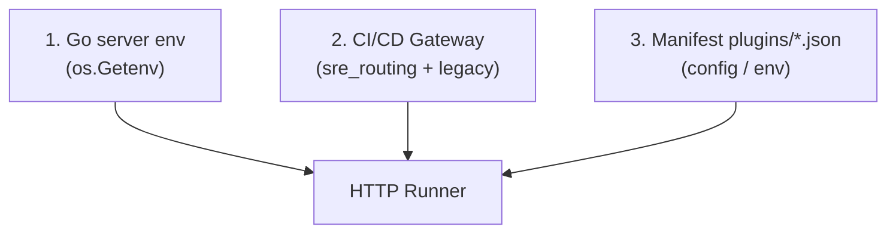

# Configuration Guide (two sides)

Each QA Capsule integration is configured in **two places**: the QA Capsule platform and the **provider** (Slack, Jira, PagerDuty, etc.).

<div align="center" class="integration-hero">
  
  
  
</div>

---

## Overview


| Side | Who configures | Where | What |
|------|---------------|-----|------|
| **Provider** | Tool admin (Slack, Atlassian, …) | Provider console | Service account, token, webhook URL, API keys |
| **QA Capsule** | Manager / Lead (configure, execute); Manager / Admin (AUTO-RUN, gateway toggles) | UI + environment variables | Secrets, routing |

---

## QA Capsule Side (detail)

### 1. Global secrets (recommended)

On the **Go process** running QA Capsule:

```bash
export SLACK_WEBHOOK_URL=https://hooks.slack.com/services/...
export JIRA_API_TOKEN=...
```

Priority: **environment variable** > `env` field in the manifest JSON.

**Never** commit tokens to Git.

### 2. Plugin Engine

| Action | Role | Description |
|--------|------|-------------|
| **Configure** | Manager / Lead | Default values in `plugins/.../*.json` (non-secrets in prod) |
| **AUTO-RUN ON/OFF** | Manager / Admin | If OFF: no auto-trigger on CI failure |
| **Execute** | Lead+ | Manual test without waiting for an incident |

Example manifest:

```json
{
  "integration": "slack",
  "name": "Smart Slack Routing",
  "status": "Active",
  "auto_run": true,
  "trigger_on": ["CRITICAL", "FLAKY", "Timeout"],
  "config": {}
}
```

### 3. CI/CD Gateway — SRE Routing

For each **pipeline**:

1. **Add configuration**
2. Choose an **Active** integration (logo in the list)
3. Fill in project fields (e.g. `#alerts-checkout`, Jira key `PAY`)

Only integrations listed on this gateway are triggered automatically (if AUTO-RUN is ON).

Example stored in the database (`sre_routing_json` on the project):

```json
[
  {
    "integration": "slack",
    "file_path": "slack/slack-notifier.json",
    "name": "Smart Slack Routing",
    "values": { "SLACK_CHANNEL": "#alerts-checkout" }
  },
  {
    "integration": "jira",
    "file_path": "jira/jira-ticket.json",
    "name": "Jira Auto Ticket",
    "values": { "JIRA_PROJECT_KEY": "PAY" }
  }
]
```

The **Add configuration** UI fills `integration`, `file_path`, `name`, and `values` according to the schema below.

### 4. Dynamic gateway fields (per integration)

These fields appear in the UI after selecting an **Active** plugin (with logo). They are injected into `ProjectRouting.Values` at run time.

| Logo | `integration` type | Technical key | UI label | Required |
|:----:|------------------|---------------|------------|-------------|
| { width="22" } | `slack` | `SLACK_CHANNEL` | Slack Channel | Recommended |
| { width="22" } | `teams` | `TEAMS_WEBHOOK_URL` | MS Teams Webhook URL | Yes if no global env |
| { width="22" } | `jira` | `JIRA_PROJECT_KEY` | Jira Project Key | Yes |
| { width="22" } | `pagerduty` | `PAGERDUTY_ROUTING_KEY` | PagerDuty Routing Key | Yes* |
| { width="22" } | `opsgenie` | `OPSGENIE_TEAM` | Opsgenie Team | No |
| { width="22" } | `victorops` | `VICTOROPS_ROUTING_URL` | VictorOps Routing URL | Yes* |
| { width="22" } | `datadog` | `DATADOG_TAGS` | Datadog Tags | No |
| { width="22" } | `webhook` | `WEBHOOK_URL` | Custom Webhook URL | Yes* |
| { width="22" } | `github` | `GITHUB_OWNER`, `GITHUB_REPO`, `GITHUB_WORKFLOW_ID` | Owner / Repo / Workflow | Yes |
| { width="22" } | `sendgrid` | `SENDGRID_TO` | Alert Email To | Yes |
| { width="22" } | `smtp` | `SMTP_TO` | SMTP Alert To | Yes |
| { width="22" } | `testrail` / `zephyr` / `xray` | `WEBHOOK_URL` | Webhook URL | Yes |
| { width="22" } | `k8s` | `WEBHOOK_URL` | GitOps Webhook URL | Roadmap |

\* May be provided only as a server environment variable; the gateway field **overrides** the global value for that pipeline.

### 5. Secret and parameter priority



| Example | Where to set on QA Capsule side | Where to set on provider side |
|---------|------------------------------|-------------------------------|
| Slack webhook URL | `SLACK_WEBHOOK_URL` in env | Slack → Incoming Webhooks → URL |
| Channel per team | Gateway **Slack Channel** | Create the `#alerts-*` channel in the workspace |
| Jira token | `JIRA_API_TOKEN` in env | Atlassian → API token (service account) |
| Jira project key | Gateway **Jira Project Key** | Existing Jira project (`PAY`, `SCRUM`, …) |

### 6. Triggering

- Ingestion: `POST /api/webhooks/` with `X-API-Key`
- Go engine: match `trigger_on` + fingerprint + `auto_run`
- No shell scripts (RCE security)
- HTTP timeout: **30 seconds** per integration call

---

## Provider Side (detail)

Depends on each tool — see the dedicated page:

| Logo | Integration | Page |
|------|-------------|------|
| { width="28" } | Slack | [slack.md](slack.md) |
| { width="28" } | Microsoft Teams | [teams.md](teams.md) |
| { width="28" } | Jira | [jira.md](jira.md) |
| { width="28" } | PagerDuty | [pagerduty.md](pagerduty.md) |
| { width="28" } | Opsgenie | [opsgenie.md](opsgenie.md) |
| { width="28" } | VictorOps | [victorops.md](victorops.md) |
| { width="28" } | Datadog | [datadog.md](datadog.md) |
| { width="28" } | GitHub Actions | [github.md](github.md) |
| { width="28" } | SendGrid / SMTP | [email.md](email.md) |
| { width="28" } | HTTP Webhook | [webhook.md](webhook.md) |
| { width="28" } | TestRail | [test-management.md](test-management.md) |
| { width="28" } | Zephyr | [test-management.md](test-management.md) |
| { width="28" } | Xray | [test-management.md](test-management.md) |
| { width="28" } | Kubernetes | [k8s.md](k8s.md) |

---

## Production Checklist

- [ ] Service account / app created with the provider
- [ ] Token or URL copied into QA Capsule server secrets
- [ ] Successful **Execute** in Plugin Engine
- [ ] AUTO-RUN enabled only when ready
- [ ] Routing added on the correct CI/CD gateway
- [ ] Real webhook test from the pipeline
