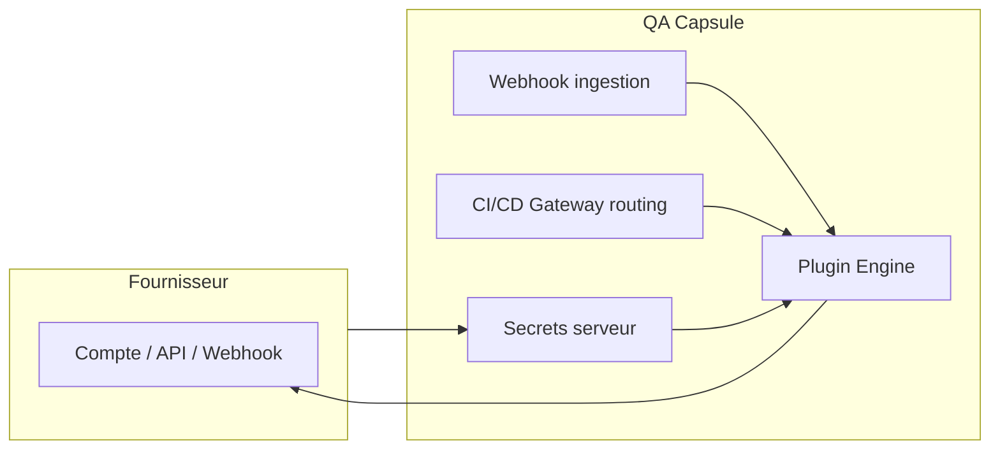
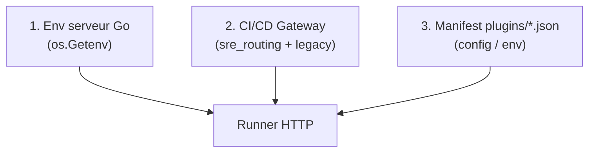

# Guide de configuration (deux côtés)

Chaque intégration QA Capsule se configure en **deux endroits** : la plateforme QA Capsule et le **fournisseur** (Slack, Jira, PagerDuty, etc.).

<div align="center" class="integration-hero">
  
  
  
</div>

---

## Vue d’ensemble



| Côté | Qui configure | Où | Quoi |
|------|---------------|-----|------|
| **Fournisseur** | Admin outil (Slack, Atlassian, …) | Console du fournisseur | Compte service, token, webhook URL, clés API |
| **QA Capsule** | Manager / Lead | UI + variables d’environnement | Secrets globaux, AUTO-RUN, routage par pipeline |

---

## Côté QA Capsule (détail)

### 1. Secrets globaux (recommandé)

Sur le **processus Go** qui exécute QA Capsule :

```bash
export SLACK_WEBHOOK_URL=https://hooks.slack.com/services/...
export JIRA_API_TOKEN=...
```

Priorité : **variable d’environnement** > champ `env` dans le manifest JSON.

Ne commitez **jamais** de tokens dans Git.

### 2. Plugin Engine

| Action | Rôle | Description |
|--------|------|-------------|
| **Configure** | Manager / Lead | Valeurs par défaut dans `plugins/.../*.json` (non secrets en prod) |
| **AUTO-RUN ON/OFF** | Manager / Admin | Si OFF : aucun déclenchement auto sur échec CI |
| **Execute** | Lead+ | Test manuel sans attendre un incident |

Manifest exemple :

```json
{
  "integration": "slack",
  "name": "Smart Slack Routing",
  "status": "Active",
  "auto_run": true,
  "trigger_on": ["CRITICAL", "FLAKY", "Timeout"],
  "config": {}
}
```

### 3. CI/CD Gateway — SRE Routing

Pour chaque **pipeline** :

1. **Add configuration**
2. Choisir une intégration **Active** (logo dans la liste)
3. Remplir les champs projet (ex. `#alerts-checkout`, clé Jira `PAY`)

Seules les intégrations listées sur ce gateway sont déclenchées automatiquement (si AUTO-RUN est ON).

Exemple stocké en base (`sre_routing_json` sur le projet) :

```json
[
  {
    "integration": "slack",
    "file_path": "slack/slack-notifier.json",
    "name": "Smart Slack Routing",
    "values": { "SLACK_CHANNEL": "#alerts-checkout" }
  },
  {
    "integration": "jira",
    "file_path": "jira/jira-ticket.json",
    "name": "Jira Auto Ticket",
    "values": { "JIRA_PROJECT_KEY": "PAY" }
  }
]
```

L’UI **Add configuration** remplit `integration`, `file_path`, `name` et les `values` selon le schéma ci-dessous.

### 4. Champs dynamiques du gateway (par intégration)

Ces champs apparaissent dans l’UI après sélection d’un plugin **Active** (avec logo). Ils sont injectés dans `ProjectRouting.Values` au moment du run.

| Logo | Type `integration` | Clé technique | Libellé UI | Obligatoire |
|:----:|------------------|---------------|------------|-------------|
| { width="22" } | `slack` | `SLACK_CHANNEL` | Slack Channel | Recommandé |
| { width="22" } | `teams` | `TEAMS_WEBHOOK_URL` | MS Teams Webhook URL | Oui si pas d’env global |
| { width="22" } | `jira` | `JIRA_PROJECT_KEY` | Jira Project Key | Oui |
| { width="22" } | `pagerduty` | `PAGERDUTY_ROUTING_KEY` | PagerDuty Routing Key | Oui* |
| { width="22" } | `opsgenie` | `OPSGENIE_TEAM` | Opsgenie Team | Non |
| { width="22" } | `victorops` | `VICTOROPS_ROUTING_URL` | VictorOps Routing URL | Oui* |
| { width="22" } | `datadog` | `DATADOG_TAGS` | Datadog Tags | Non |
| { width="22" } | `webhook` | `WEBHOOK_URL` | Custom Webhook URL | Oui* |
| { width="22" } | `github` | `GITHUB_OWNER`, `GITHUB_REPO`, `GITHUB_WORKFLOW_ID` | Owner / Repo / Workflow | Oui |
| { width="22" } | `sendgrid` | `SENDGRID_TO` | Alert Email To | Oui |
| { width="22" } | `smtp` | `SMTP_TO` | SMTP Alert To | Oui |
| { width="22" } | `testrail` / `zephyr` / `xray` | `WEBHOOK_URL` | Webhook URL | Oui |
| { width="22" } | `k8s` | `WEBHOOK_URL` | GitOps Webhook URL | Roadmap |

\* Peut être fourni uniquement en variable d’environnement serveur ; le champ gateway **surcharge** la valeur globale pour ce pipeline.

### 5. Priorité des secrets et paramètres



| Exemple | Où le mettre côté QA Capsule | Où le mettre côté fournisseur |
|---------|------------------------------|-------------------------------|
| URL webhook Slack | `SLACK_WEBHOOK_URL` en env | Slack → Incoming Webhooks → URL |
| Canal par équipe | Gateway **Slack Channel** | Créer le canal `#alerts-*` dans le workspace |
| Token Jira | `JIRA_API_TOKEN` en env | Atlassian → API token (compte technique) |
| Clé projet Jira | Gateway **Jira Project Key** | Projet Jira existant (`PAY`, `SCRUM`, …) |

### 6. Déclenchement

- Ingestion : `POST /api/webhooks/` avec `X-API-Key`
- Moteur Go : match `trigger_on` + fingerprint + `auto_run`
- Pas de script shell (sécurité RCE)
- Timeout HTTP : **30 secondes** par appel intégration

---

## Côté fournisseur (détail)

Dépend de chaque outil — voir la page dédiée :

| Logo | Intégration | Page |
|------|-------------|------|
| { width="28" } | Slack | [slack.md](slack.md) |
| { width="28" } | Microsoft Teams | [teams.md](teams.md) |
| { width="28" } | Jira | [jira.md](jira.md) |
| { width="28" } | PagerDuty | [pagerduty.md](pagerduty.md) |
| { width="28" } | Opsgenie | [opsgenie.md](opsgenie.md) |
| { width="28" } | VictorOps | [victorops.md](victorops.md) |
| { width="28" } | Datadog | [datadog.md](datadog.md) |
| { width="28" } | GitHub Actions | [github.md](github.md) |
| { width="28" } | SendGrid / SMTP | [email.md](email.md) |
| { width="28" } | Webhook HTTP | [webhook.md](webhook.md) |
| { width="28" } | TestRail | [test-management.md](test-management.md) |
| { width="28" } | Zephyr | [test-management.md](test-management.md) |
| { width="28" } | Xray | [test-management.md](test-management.md) |
| { width="28" } | Kubernetes | [k8s.md](k8s.md) |

---

## Checklist de mise en production

- [ ] Compte / app créé chez le fournisseur
- [ ] Token ou URL copié dans les secrets serveur QA Capsule
- [ ] **Execute** réussi dans Plugin Engine
- [ ] AUTO-RUN activé uniquement quand prêt
- [ ] Routage ajouté sur le bon gateway CI/CD
- [ ] Test webhook réel depuis la pipeline
