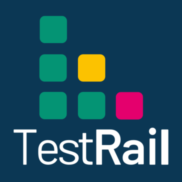

# Integration Catalog

All integrations are implemented in **Go** (native HTTP). Quick reference with logos.

!!! tip "Detailed two-sided configuration"
    Read the [Configuration Guide (QA Capsule + provider)](configuration-guide.md) first, then each tool's dedicated page.

---

## Summary Table

| Logo | Integration | Page | Global secrets (examples) | Gateway fields |
|:----:|-------------|------|---------------------------|----------------|
| { width="36" } | Slack | [slack.md](slack.md) | `SLACK_WEBHOOK_URL` | Slack Channel |
| { width="36" } | Microsoft Teams | [teams.md](teams.md) | `TEAMS_WEBHOOK_URL` | MS Teams Webhook URL |
| { width="36" } | Jira | [jira.md](jira.md) | `JIRA_URL`, `JIRA_EMAIL`, `JIRA_API_TOKEN` | Jira Project Key |
| { width="36" } | PagerDuty | [pagerduty.md](pagerduty.md) | `PAGERDUTY_ROUTING_KEY` | PagerDuty Routing Key |
| { width="36" } | Opsgenie | [opsgenie.md](opsgenie.md) | `OPSGENIE_API_KEY` | Opsgenie Team |
| { width="36" } | VictorOps | [victorops.md](victorops.md) | `VICTOROPS_ROUTING_URL` | VictorOps Routing URL |
| { width="36" } | Datadog | [datadog.md](datadog.md) | `DD_API_KEY`, `DD_SITE` | Datadog Tags |
| { width="36" } | Webhook | [webhook.md](webhook.md) | `WEBHOOK_URL` | Custom Webhook URL |
| { width="36" } | GitHub Actions | [github.md](github.md) | `GITHUB_TOKEN` | Owner, Repo, Workflow ID |
| { width="36" } | SendGrid | [email.md](email.md) | `SENDGRID_API_KEY`, `FROM`, `TO` | Alert Email To |
| { width="36" } | SMTP | [email.md](email.md) | `SMTP_HOST`, `USER`, `PASS` | SMTP Alert To |
| { width="36" } | TestRail | [test-management.md](test-management.md) | `WEBHOOK_URL` (+ API*) | Webhook URL |
| { width="36" } | Zephyr | [test-management.md](test-management.md) | `WEBHOOK_URL` | Webhook URL |
| { width="36" } | Xray | [test-management.md](test-management.md) | `WEBHOOK_URL` | Webhook URL |
| { width="36" } | QA Flaky | [webhook.md](webhook.md) | `WEBHOOK_URL` | Custom Webhook URL |
| { width="36" } | Kubernetes | [k8s.md](k8s.md) | — (stub) | GitOps Webhook URL |

\* Native TestRail/Zephyr/Xray APIs: roadmap; use webhook in the meantime.

---

## QA Capsule Role Matrix

| Action | Platform Admin | Manager | Lead | Observer |
|--------|------------------|---------|------|----------|
| AUTO-RUN ON/OFF | Yes | Yes | No | No |
| Configure secrets (UI) | Yes | Yes | Yes | No |
| Execute test | Yes | Yes | Yes | No |
| Gateway Add configuration | Yes | Yes | Yes | No |

---

## Manifest Files

```
plugins/
├── slack/slack-notifier.json
├── teams/teams.json
├── jira/jira-ticket.json
├── pagerduty/pagerduty.json
├── opsgenie/opsgenie-alert.json
├── victorops/victorops-alert.json
├── datadog/datadog-event.json
├── webhook/custom-webhook.json
├── github/github-rerun.json
├── email/sendgrid-alert.json
├── email/smtp-alert.json
├── testrail/testrail-result.json
├── zephyr/zephyr-execution.json
├── xray/xray-result.json
├── qa/flaky-report.json
└── k8s/k8s-restart.json
```

---

## See Also

- [Plugin Engine Overview](overview.md)
- [Webhooks API](../api/webhooks.md)
