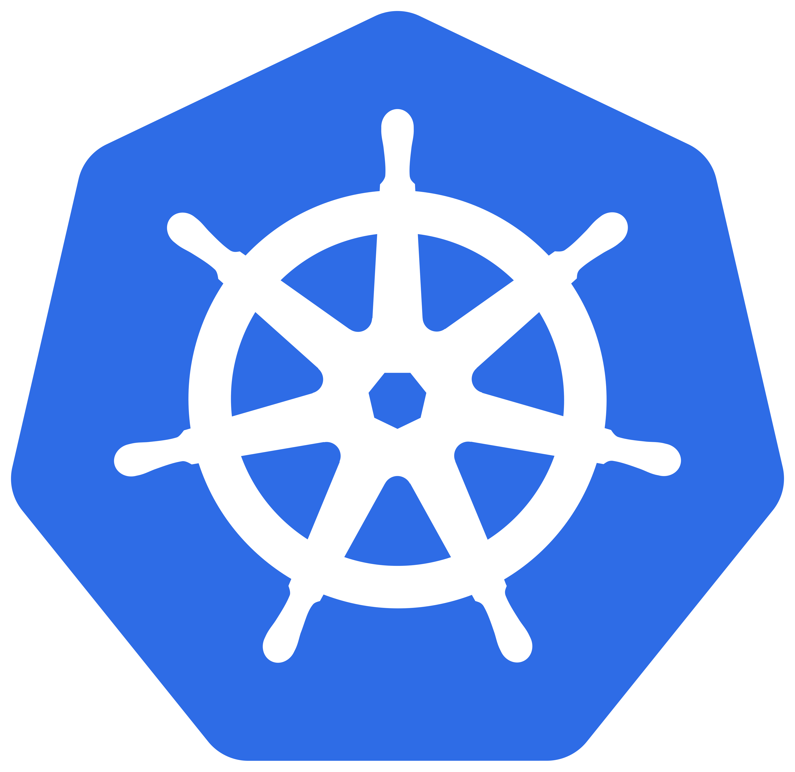

# Kubernetes

  

| | |
|---|---|
| **Manifest** | `plugins/k8s/k8s-restart.json` |
| **Type** | `k8s` |
| **Status** | **Stub** — no cluster access in community edition (security) |

---

=== "QA Capsule Side"

    The `k8s` integration returns an explicit message directing you to use a **webhook** to GitOps / an operator.

    ## Recommended pattern

    1. Enable the **Custom Webhook** or **GitHub Actions** integration
    2. Gateway: URL to your controller (e.g. restart deployment, Argo CD sync)
    3. Standard QA Capsule payload (see [webhook.md](webhook.md))

    ## k8s gateway (optional)

    **GitOps / Operator Webhook URL** field → same runner as `webhook`.

=== "Provider Side (Kubernetes / GitOps)"

    ## 1. Do not expose kubeconfig to QA Capsule

    Prefer an intermediary service that:

    - Validates a webhook token
    - Applies a limited action (rollout restart, scale, sync)

    ## 2. Example tools

    | Tool | Role |
    |-------|------|
    | Argo CD | Sync application after incident |
    | Flux | Reconcile GitOps |
    | Internal API | Encapsulated `kubectl rollout restart` |

    ## 3. Cluster RBAC

    Dedicated ServiceAccount with minimal permissions on a target namespace.

---

- [Webhook](webhook.md) · [Catalog](integrations-catalog.md)
