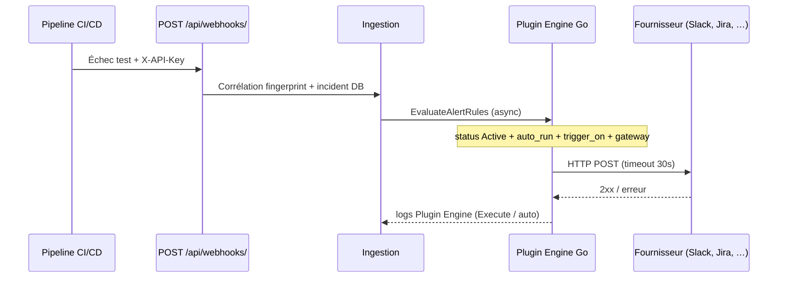

# Plugin Engine (intégrations natives Go)

<div align="center" class="integration-hero">
  
  
  
  
  
</div>

Le moteur de remédiation exécute des appels **HTTP natifs** (Slack, Jira, PagerDuty, …). Les scripts shell ne sont **plus** exécutés (prévention RCE). Le code vit dans `pkg/integrations/` (`registry.go`, `engine.go`, `runners.go`, `routing_schema.go`).

---

## Documentation recommandée

1. **[Guide de configuration — deux côtés](configuration-guide.md)** — QA Capsule vs fournisseur
2. **[Catalogue avec logos](integrations-catalog.md)** — tableau de toutes les intégrations
3. Page par outil (Slack, Jira, …) — onglets **Côté QA Capsule** / **Côté fournisseur**

---

## Architecture

| Couche | Rôle |
|--------|------|
| `plugins/**/*.json` | Manifests (integration, trigger_on, auto_run) |
| `pkg/integrations` | Registry + runners HTTP |
| Plugin Engine UI | Configure, AUTO-RUN, Execute |
| CI/CD Gateway | Routage par pipeline (**Add configuration**) |

Chargement **une fois au démarrage** du serveur. Modifier un manifest → redémarrer QA Capsule.



---

## Cycle de vie d’un déclenchement

| Étape | Composant | Détail |
|-------|-----------|--------|
| 1 | Webhook | `POST /api/webhooks/` avec clé projet ; payload JSON ou JUnit |
| 2 | Ingestion | Création/mise à jour incident, tags `[FLAKY]` / `[PERF]`, fingerprint |
| 3 | Contexte projet | `ProjectAlertContext` charge `sre_routing_json` + colonnes legacy |
| 4 | Filtre gateway | Si le projet a des entrées SRE routing, **seuls** les manifests listés (`file_path`) peuvent partir en auto |
| 5 | Moteur | `EvaluateAlertRules` parcourt le registry ; match sur texte alerte (`name` + `error` + `console_logs`) |
| 6 | Runner | `runSlack`, `runJira`, … — un goroutine par intégration déclenchée |

### Conditions pour un AUTO-RUN (les quatre doivent être vraies)

1. Manifest `status` = **Active** (insensible à la casse)
2. Manifest `auto_run` = **true**
3. Au moins un mot-clé de `trigger_on` apparaît dans le texte de l’alerte (insensible à la casse)
4. **Gateway** : si le projet a au moins une ligne **Add configuration**, seules ces intégrations sont autorisées ; sinon fallback sur colonnes legacy (`slack_channel`, `jira_project_key`, `teams_webhook`)

!!! warning "Scripts shell ignorés"
    Les anciens manifests avec `"command": "bash ..."` ne sont **jamais** exécutés. Seul le champ `"integration"` (ou le dossier sous `plugins/`) détermine le runner Go.

---

## Priorité de configuration

Pour chaque clé (`SLACK_WEBHOOK_URL`, `JIRA_PROJECT_KEY`, …) :

| Priorité | Source | Exemple |
|:--------:|--------|---------|
| 1 (la plus forte) | Variable d’environnement du **processus Go** | `export SLACK_WEBHOOK_URL=...` |
| 2 | Valeurs du **CI/CD Gateway** (`sre_routing[].values` + colonnes legacy) | `#alerts-checkout`, clé Jira `PAY` |
| 3 | Manifest `config` / `env` dans `plugins/**/*.json` | Valeurs par défaut non sensibles |

Fusion côté code : `mergedConfig(manifest, routing)` puis lecture via `configVal()` qui lit d’abord `os.Getenv`.

---

## Runners natifs (type → HTTP)

| Logo | `integration` | Runner | API / protocole |
|:----:|---------------|--------|-----------------|
| { width="24" } | `slack` | `runSlack` | Incoming Webhook JSON |
| { width="24" } | `teams` | `runTeams` | Connector Office 365 |
| { width="24" } | `jira` | `runJira` | REST API v3 (Basic auth) |
| { width="24" } | `pagerduty` | `runPagerDuty` | Events API v2 |
| { width="24" } | `opsgenie` | `runOpsgenie` | Alert API |
| { width="24" } | `victorops` | `runVictorOps` | REST incident |
| { width="24" } | `datadog` | `runDatadog` | Events API |
| { width="24" } | `webhook` | `runWebhook` | POST JSON générique |
| { width="24" } | `github` | `runGitHub` | `workflow_dispatch` |
| { width="24" } | `sendgrid` / `smtp` | `runSendGrid` / `runSMTP` | API ou SMTP |
| { width="24" } | `testrail`, `zephyr`, `xray`, `qa` | `runWebhook` | URL configurée |
| { width="24" } | `k8s` | `runK8sStub` | Stub (roadmap) |

---

## Champs manifest

```json
{
  "integration": "slack",
  "name": "Smart Slack Routing",
  "status": "Active",
  "auto_run": true,
  "trigger_on": ["CRITICAL", "FLAKY"],
  "config": {}
}
```

| Champ | Description |
|-------|-------------|
| `integration` | Type Go : `slack`, `jira`, `teams`, … |
| `status` | `Active` = visible dans le dropdown gateway |
| `auto_run` | Si `false`, pas de déclenchement auto sur webhook |
| `trigger_on` | Mots-clés dans nom/erreur/logs |

---

## Secrets

Ordre de priorité : **variable d’environnement serveur** > `config` / `env` dans le JSON.

```bash
export SLACK_WEBHOOK_URL=https://hooks.slack.com/...
```

---

## AUTO-RUN et gateway

- **Manager / Admin** : bouton AUTO-RUN dans Plugin Engine
- **Manager / Lead** : **Add configuration** sur chaque pipeline — seules ces intégrations sont déclenchées pour ce projet

---

## API

| Méthode | Path |
|---------|------|
| GET | `/api/plugins` |
| GET | `/api/plugins/active` |
| POST | `/api/plugins/autorun` |
| POST | `/api/plugins/config` |
| POST | `/api/plugins/run` |

---

## Guides par fournisseur

[Slack](slack.md) · [Teams](teams.md) · [Jira](jira.md) · [PagerDuty](pagerduty.md) · [Opsgenie](opsgenie.md) · [VictorOps](victorops.md) · [Datadog](datadog.md) · [Webhook](webhook.md) · [GitHub](github.md) · [Email](email.md) · [Test management](test-management.md) · [Kubernetes](k8s.md)
