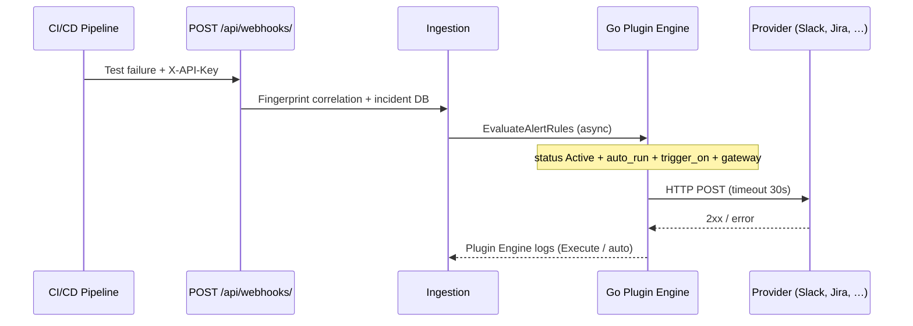

# Plugin Engine (native Go integrations)

<div align="center" class="integration-hero">
  
  
  
  
  
</div>

The remediation engine executes **native HTTP** calls (Slack, Jira, PagerDuty, …). Shell scripts are **no longer** executed (RCE prevention). The code lives in `pkg/integrations/` (`registry.go`, `engine.go`, `runners.go`, `routing_schema.go`).

---

## Recommended Documentation

1. **[Configuration Guide — two sides](configuration-guide.md)** — QA Capsule vs provider
2. **[Catalog with logos](integrations-catalog.md)** — table of all integrations
3. Per-tool pages (Slack, Jira, …) — **QA Capsule side** / **Provider side** tabs

---

## Architecture

| Layer | Role |
|--------|------|
| `plugins/**/*.json` | Manifests (integration, trigger_on, auto_run) |
| `pkg/integrations` | Registry + HTTP runners |
| Plugin Engine UI | Configure, AUTO-RUN, Execute |
| CI/CD Gateway | Pipeline routing (**Add configuration**) |

Loaded **once at server startup**. After modifying a manifest → restart QA Capsule.



---

## Trigger Lifecycle

| Step | Component | Detail |
|-------|-----------|--------|
| 1 | Webhook | `POST /api/webhooks/` with project key; JSON or JUnit payload |
| 2 | Ingestion | Create/update incident, `[FLAKY]` / `[PERF]` tags, fingerprint |
| 3 | Project context | `ProjectAlertContext` loads `sre_routing_json` + legacy columns |
| 4 | Gateway filter | If the project has SRE routing entries, **only** listed manifests (`file_path`) may auto-run |
| 5 | Engine | `EvaluateAlertRules` iterates the registry; match on alert text (`name` + `error` + `console_logs`) |
| 6 | Runner | `runSlack`, `runJira`, … — one goroutine per triggered integration |

### Conditions for AUTO-RUN (all four must be true)

1. Manifest `status` = **Active** (case-insensitive)
2. Manifest `auto_run` = **true**
3. At least one keyword from `trigger_on` appears in the alert text (case-insensitive)
4. **Gateway**: if the project has at least one **Add configuration** row, only those integrations are allowed; otherwise fallback to legacy columns (`slack_channel`, `jira_project_key`, `teams_webhook`)

!!! warning "Shell scripts ignored"
    Legacy manifests with `"command": "bash ..."` are **never** executed. Only the `"integration"` field (or the folder under `plugins/`) determines the Go runner.

---

## Configuration Priority

For each key (`SLACK_WEBHOOK_URL`, `JIRA_PROJECT_KEY`, …):

| Priority | Source | Example |
|:--------:|--------|---------|
| 1 (highest) | **Go process** environment variable | `export SLACK_WEBHOOK_URL=...` |
| 2 | **CI/CD Gateway** values (`sre_routing[].values` + legacy columns) | `#alerts-checkout`, Jira key `PAY` |
| 3 | Manifest `config` / `env` in `plugins/**/*.json` | Non-sensitive default values |

Code-side merge: `mergedConfig(manifest, routing)` then read via `configVal()` which checks `os.Getenv` first.

---

## Native Runners (type → HTTP)

| Logo | `integration` | Runner | API / protocol |
|:----:|---------------|--------|-----------------|
| { width="24" } | `slack` | `runSlack` | Incoming Webhook JSON |
| { width="24" } | `teams` | `runTeams` | Office 365 Connector |
| { width="24" } | `jira` | `runJira` | REST API v3 (Basic auth) |
| { width="24" } | `pagerduty` | `runPagerDuty` | Events API v2 |
| { width="24" } | `opsgenie` | `runOpsgenie` | Alert API |
| { width="24" } | `victorops` | `runVictorOps` | REST incident |
| { width="24" } | `datadog` | `runDatadog` | Events API |
| { width="24" } | `webhook` | `runWebhook` | Generic JSON POST |
| { width="24" } | `github` | `runGitHub` | `workflow_dispatch` |
| { width="24" } | `sendgrid` / `smtp` | `runSendGrid` / `runSMTP` | API or SMTP |
| { width="24" } | `testrail`, `zephyr`, `xray`, `qa` | `runWebhook` | Configured URL |
| { width="24" } | `k8s` | `runK8sStub` | Stub (roadmap) |

---

## Manifest Fields

```json
{
  "integration": "slack",
  "name": "Smart Slack Routing",
  "status": "Active",
  "auto_run": true,
  "trigger_on": ["CRITICAL", "FLAKY"],
  "config": {}
}
```

| Field | Description |
|-------|-------------|
| `integration` | Go type: `slack`, `jira`, `teams`, … |
| `status` | `Active` = visible in gateway dropdown |
| `auto_run` | If `false`, no auto-trigger on webhook |
| `trigger_on` | Keywords in name/error/logs |

---

## Secrets

Priority order: **server environment variable** > `config` / `env` in JSON.

```bash
export SLACK_WEBHOOK_URL=https://hooks.slack.com/...
```

---

## AUTO-RUN and Gateway

- **Manager / Admin**: AUTO-RUN button in Plugin Engine
- **Manager / Lead**: **Add configuration** on each pipeline — only these integrations are triggered for that project

---

## API

| Method | Path |
|---------|------|
| GET | `/api/plugins` |
| GET | `/api/plugins/active` |
| POST | `/api/plugins/autorun` |
| POST | `/api/plugins/config` |
| POST | `/api/plugins/run` |

---

## Provider Guides

[Slack](slack.md) · [Teams](teams.md) · [Jira](jira.md) · [PagerDuty](pagerduty.md) · [Opsgenie](opsgenie.md) · [VictorOps](victorops.md) · [Datadog](datadog.md) · [Webhook](webhook.md) · [GitHub](github.md) · [Email](email.md) · [Test management](test-management.md) · [Kubernetes](k8s.md)
