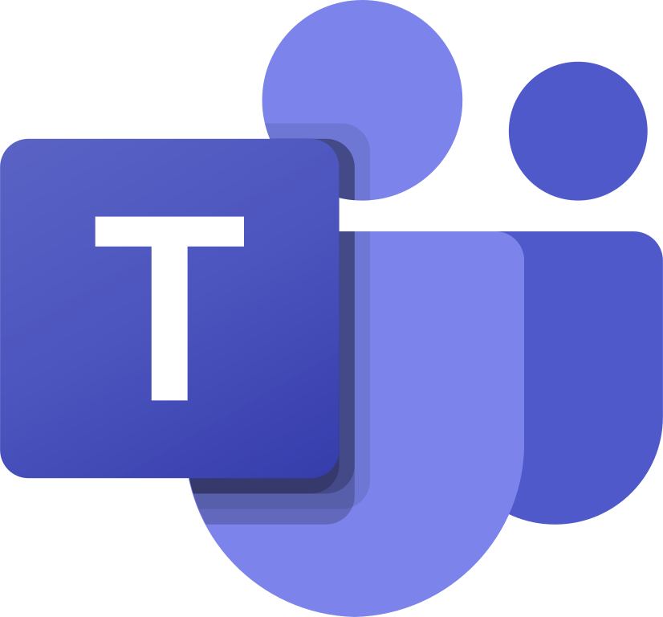

# Microsoft Teams

<div align="center" class="integration-hero">
  
</div>

Publie une **MessageCard** sur un connecteur Entrant (Incoming Webhook) Teams.

| | |
|---|---|
| **Manifest** | `plugins/teams/teams.json` |
| **Type** | `teams` |

---

=== "Côté QA Capsule"

    ## Variables

    | Variable | Obligatoire | Où |
    |----------|-------------|-----|
    | `TEAMS_WEBHOOK_URL` | **Oui** | Env global **ou** champ gateway **MS Teams Webhook URL** |

    Le moteur accepte aussi l’alias `TEAMS_WEBHOOK` dans le routage legacy.

    ## Plugin Engine

    - **Configure** : URL complète du connecteur
    - **Execute** → HTTP 200/202 attendu
    - **AUTO-RUN** : Manager uniquement

    ## CI/CD Gateway

    **Add configuration** → **Teams** → coller l’URL du connecteur **spécifique au canal** de l’équipe (chaque équipe peut avoir sa propre URL).

    ## Message envoyé

    MessageCard Office 365 avec titre incident, statut, texte d’erreur (markdown).

=== "Côté fournisseur (Microsoft Teams)"

    ## 1. Connecteur Entrant (Incoming Webhook)

    1. Teams → canal cible → **⋯** → **Connecteurs** (Connectors)
    2. Chercher **Incoming Webhook** → **Configurer**
    3. Nom : `QA Capsule Alerts` → créer
    4. Copier l’URL `https://....webhook.office.com/...`

    ## 2. Bonnes pratiques

    | Point | Détail |
    |-------|--------|
    | Une URL par canal | Pas de routage dynamique de canal comme Slack — prévoir une URL par équipe/projet |
    | Sécurité | URL = secret ; régénérer si exposée |
    | Politique entreprise | Vérifier que les connecteurs Entrants sont autorisés par l’IT |

    ## 3. Test

    ```bash
    curl -H "Content-Type: application/json" -d '{"@type":"MessageCard","@context":"http://schema.org/extensions","summary":"Test","themeColor":"E81123","sections":[{"activityTitle":"QA Capsule test","text":"Hello"}]}' \
      "URL_DU_CONNECTEUR"
    ```

---

- [Guide configuration](configuration-guide.md)
