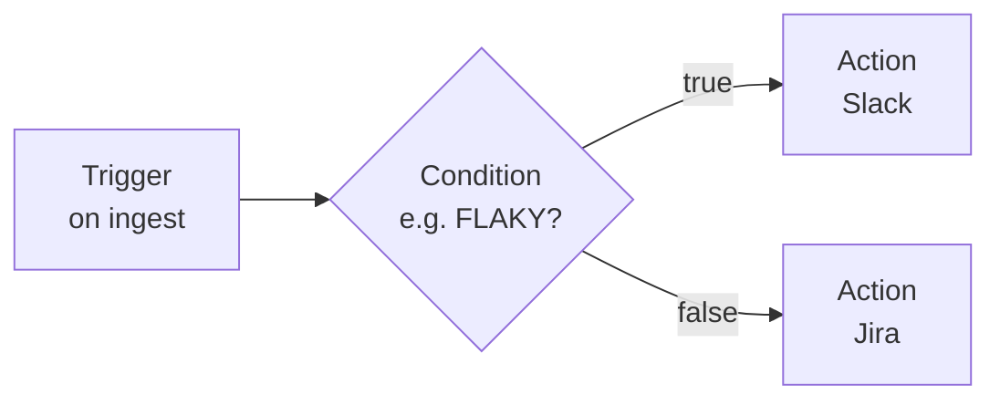

# Visual Workflow Builder

The **Visual Workflow Builder** lets Lead, Manager, and Platform Admin users draw remediation **DAGs** (decision trees) per CI/CD gateway project. When enabled, the DAG replaces the legacy linear AUTO-RUN loop for that pipeline.

Observers use the Operations dashboard only; they do not access CI/CD Gateways or this editor.

---

## Design schema



See full diagrams: [Design Schemas & Diagrams](../guides/design-diagrams.md) §8–9, §17.

---

## Concepts

| Node type | Purpose |
|-----------|---------|
| **Trigger** | Single entry point when an alert is ingested |
| **Condition** | Branches on tag prefix (`[FLAKY]`, `[PERF]`), status, or text match |
| **Action** | Executes one **native** integration from `plugins/` via the Go registry |

Actions never run shell commands. Only manifests known to `pkg/integrations/registry.go` are allowed.

---

## Prerequisites

1. A **Manager** activates integrations in **Plugin Engine** (Configure & Save or **Enable for gateways**).
2. On the **CI/CD Gateway**, use **Add configuration** to set routing values (`SLACK_CHANNEL`, `JIRA_PROJECT_KEY`, etc.).
3. Open **WORKFLOW** on the pipeline row to draw the DAG.

---

## Example

```json
{
  "version": 1,
  "enabled": true,
  "entry": "n_start",
  "nodes": {
    "n_start": { "type": "trigger", "label": "On CI alert" },
    "n_flaky": {
      "type": "condition",
      "label": "Is flaky?",
      "when": { "op": "tag", "match": "prefix", "value": "[FLAKY]", "field": "incident.name" }
    },
    "n_slack": {
      "type": "action",
      "file_path": "slack/slack-notifier.json",
      "integration": "slack"
    },
    "n_jira": {
      "type": "action",
      "file_path": "jira/jira-ticket.json",
      "integration": "jira"
    }
  },
  "edges": [
    { "from": "n_start", "to": "n_flaky" },
    { "from": "n_flaky", "to": "n_slack", "when": "true" },
    { "from": "n_flaky", "to": "n_jira", "when": "false" }
  ]
}
```

---

## Backward compatibility

| Storage | Behavior |
|---------|----------|
| `sre_routing_json` | Unchanged — linear routing values + allowed plugin paths |
| `sre_workflow_json` empty or `enabled: false` | Legacy `EvaluateAlertRules` + `trigger_on` on manifests |
| `sre_workflow_json` active | `WorkflowEngine` walks the DAG |
| Legacy columns `slack_channel`, `jira_project_key`, `teams_webhook` | Still used as fallback for allowed paths |

---

## API

| Method | Path | RBAC |
|--------|------|------|
| `GET` | `/api/projects/{id}/workflow` | Team member+ (read) |
| `PUT` | `/api/projects/{id}/workflow` | Lead, Manager, Admin |
| `DELETE` | `/api/projects/{id}/workflow` | Lead, Manager, Admin |

`PUT` returns `400` if the graph has cycles, unknown `file_path`, or integrations not configured on the gateway.

---

## Condition operators

| `op` | Description |
|------|-------------|
| `tag` | `match: prefix` on `incident.name`, or `eq` / `in` on derived tags |
| `status` | `eq` or `in` on alert status |
| `text` | `contains` on name, error, or console |
| `and` / `or` | Nested sub-expressions |

---

## UI

- **Drawflow** powers the canvas (Vanilla JS).
- **Enable workflow** — checkbox in the editor toolbar. When off, the graph is saved as a **draft** (legacy AUTO-RUN still runs). When on, the DAG replaces linear auto-trigger for that pipeline.
- **Status pill** — `Legacy` / `Draft` / `DAG active` in the editor; the gateways table shows **Workflow** column badges (`Legacy`, `Draft`, `Active`).
- **?** opens the in-editor Help Center.
- **Save** persists canonical JSON + Drawflow layout in `ui`.
- **Reset** clears the DAG and restores legacy AUTO-RUN for the project.

---

## Toolbar reference

| Button | Role | Description |
|--------|------|-------------|
| **?** | All | Toggle help / simulate panel |
| **Example** | Lead+ | Load sample flaky → Slack/Jira DAG |
| **+ Trigger / Condition / Action** | Lead+ | Add node types |
| **Simulate** | Lead+ | Dry-run with side-panel sample incident |
| **Fit** | All | Re-center canvas zoom |
| **Reset** | Lead+ | Delete DAG (confirm) |
| **Save** | Lead+ | Persist to `sre_workflow_json` |
| **Enable workflow** | Lead+ | When saved checked, DAG is live |

---

## Simulation API

```http
POST /api/projects/{projectId}/workflow/simulate
Authorization: Bearer <jwt>
Content-Type: application/json

{
  "name": "[FLAKY] checkout payment",
  "status": "CRITICAL",
  "error": "timeout waiting for upstream",
  "workflow": { ... optional canvas DAG ... }
}
```

Response:

```json
{
  "sample": { "name": "...", "status": "...", "error": "..." },
  "plan": {
    "visited": ["n_start:trigger", "n_flaky:condition", "n_slack:action"],
    "actions": ["slack/slack-notifier.json"],
    "skipped": []
  }
}
```

If `workflow` is omitted, the server uses the last **saved** DAG from the database.

---

## Allowed plugins semantics

| `allowed` map | Runtime behavior |
|---------------|------------------|
| `null` (no routing rows) | Legacy: all routing-active plugins may run |
| `{}` empty | Explicit deny: **no** workflow actions execute |
| `{ "slack/...": true, ... }` | Only listed `file_path` values run |

Validation on **Save** (when enabled) rejects paths not on the gateway or inactive in registry.

---

## Troubleshooting

| Issue | Resolution |
|-------|------------|
| Action never runs | Check gateway routing matrix includes plugin; enable workflow; verify branch `when` |
| Second action skipped | Expected if first action not allowed — engine **continues** branch (does not stop) |
| Save returns 400 | Cycle in graph, unknown `file_path`, or plugin not routing-enabled |
| Legacy still fires | Workflow `enabled: false` or empty — only draft saved |

See also [Platform User Guide](../guides/platform-user-guide.md) §5.
